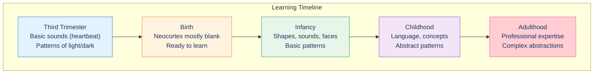
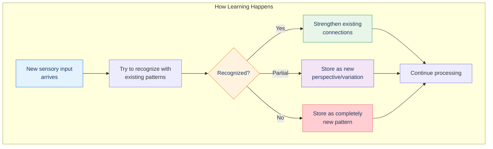
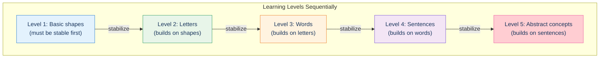
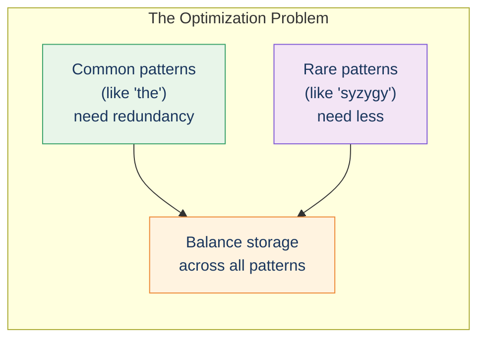
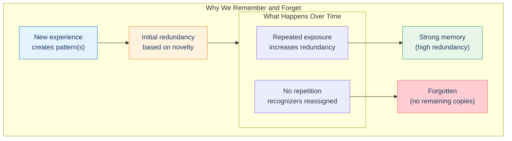
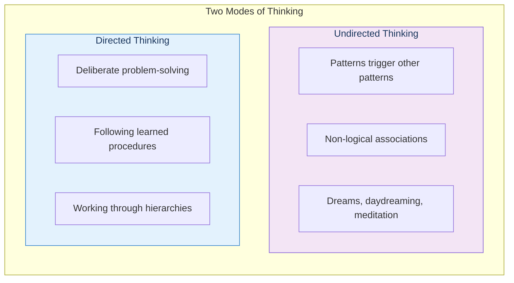
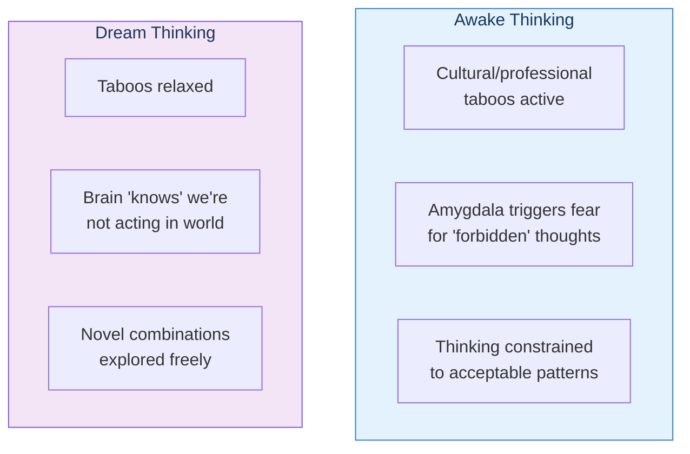

# Learning

> "The principal activities of brains are making changes in themselves."
> — Marvin Minsky

## The Core Insight

We are not born with patterns in our neocortex. The ability to recognize faces, understand language, appreciate irony—all of this is learned through experience. Learning and recognition happen simultaneously, using the same mechanisms.

## Learning from Birth

Even in the womb, the fetus begins learning:
- **Heart rhythm** — Why music with heartbeat-like tempo is universal
- **Light patterns** — Eyes partially open at 26 weeks
- **Sound patterns** — Mother's voice becomes familiar

## The Learning Process

## One Level at a Time

An important constraint: **we can only learn one or two conceptual levels at a time**.

This is why:
- Infants must master basic sounds before words
- Students learn arithmetic before algebra
- Expertise takes years to develop

## Optimal Redundancy

The brain faces an optimization problem: how to allocate limited pattern recognizers?

The brain uses something like **linear programming** to optimally allocate:
- Very common patterns → high redundancy (thousands of copies)
- Brand new patterns → low redundancy (single digits)
- Routine patterns → enough for reliable recognition, no more

## Memory and Forgetting

This explains:
- **Why repetition helps memory** — Builds redundancy
- **Why we forget unused memories** — Recognizers get reassigned
- **Why trauma is memorable** — High emotional salience creates instant redundancy

## Thinking Modes

The neocortex has two modes of thought:

Both modes use the same pattern-triggering mechanism—they just differ in how constrained the triggering is.

## Dreams and Creativity

Dreams are undirected thinking with **relaxed cultural taboos**:

Kurzweil uses this for creative problem-solving:
1. Think about a problem before sleep
2. Let dreams explore without constraints
3. Access dream thoughts during lucid dreaming
4. Harvest creative solutions!

## Key Takeaways

1. **Learning and recognition are the same process** — Both use pattern matching
2. **One level at a time** — Must master basics before abstractions
3. **Optimal redundancy** — Brain balances storage across patterns
4. **Memories fade without reinforcement** — Recognizers get reassigned
5. **Two thinking modes** — Directed and undirected, same mechanism
6. **Dreams relax constraints** — Enabling creative exploration

## Think About It

- Why can't we learn calculus before arithmetic?
- How does the brain decide which memories to keep vs. forget?
- How might understanding this help us learn more effectively?

## Related

- **Previous:** [Pattern Recognizers](/chapters/03-pattern-recognition-theory/recognizers/)
- **Next:** [Chapter 4: The Biological Neocortex](/chapters/04-biological-neocortex/overview/)
- **Concept:** [Hierarchical Learning](/concepts/hierarchical-learning/)
