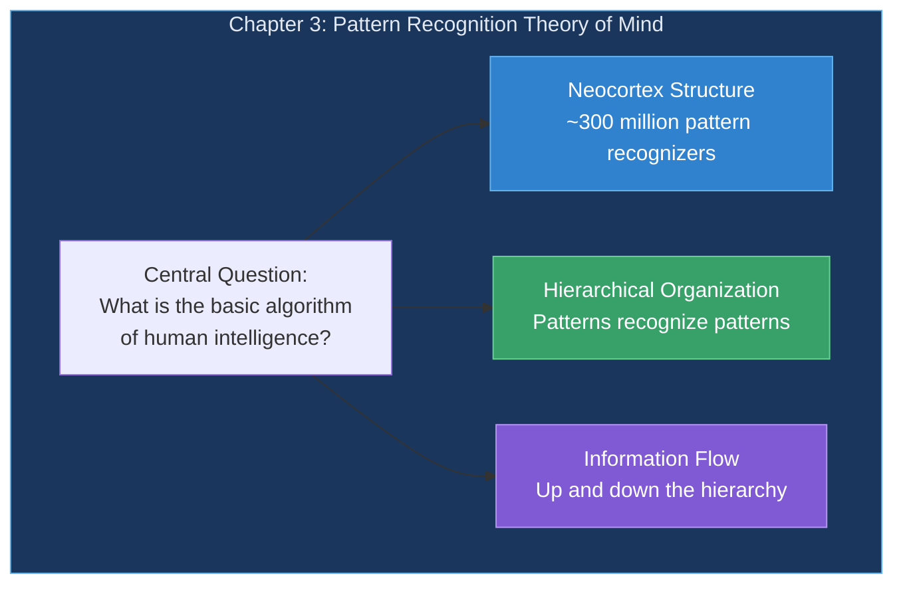
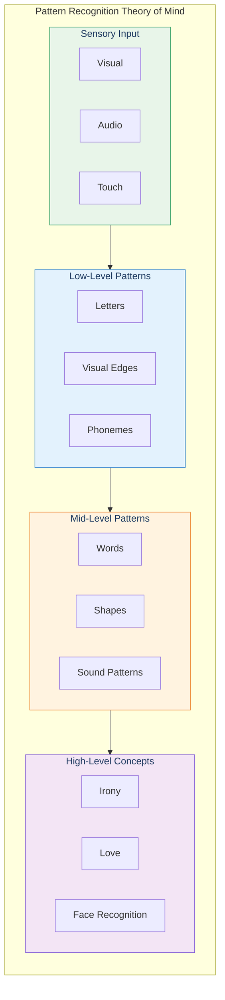
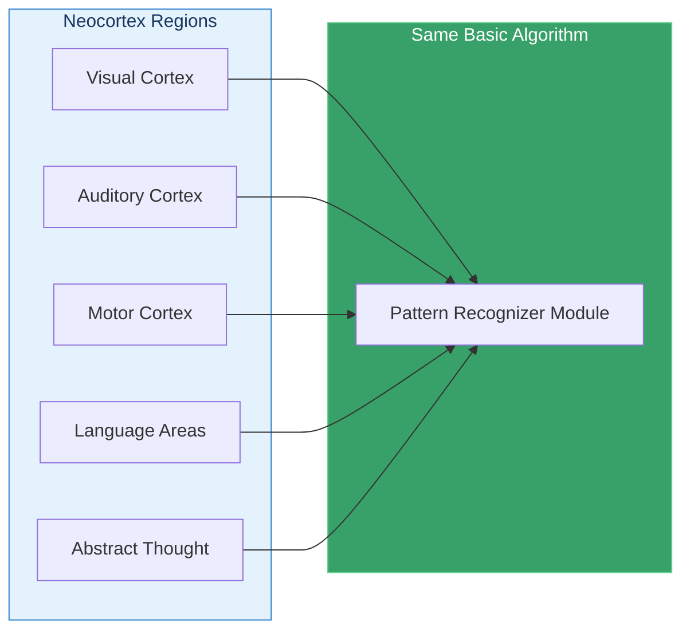
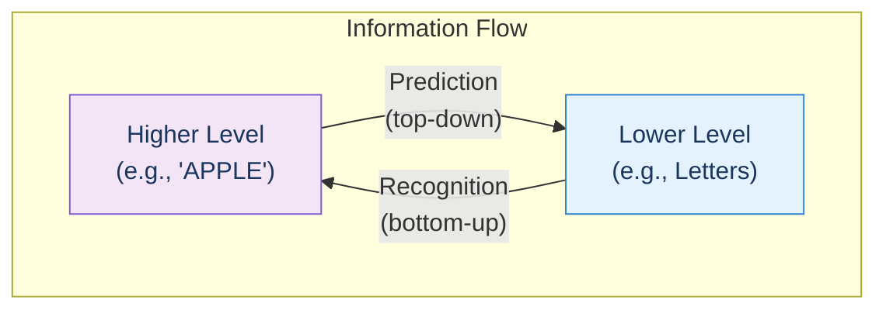
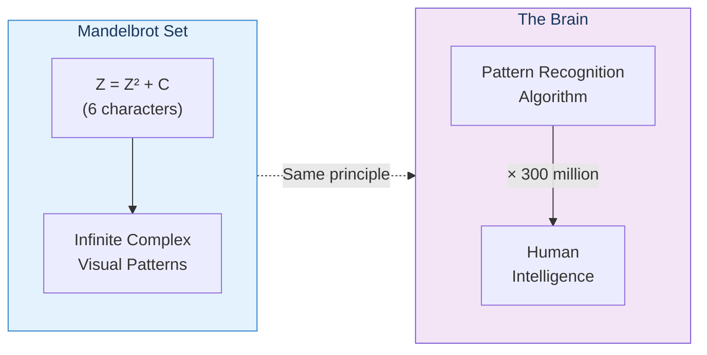

# Chapter 3: A Model of the Neocortex

> "The brain is a tissue. It is a complicated, intricately woven tissue, like nothing else we know of in the universe, but it is composed of cells, as any tissue is."
> — David H. Hubel

This chapter presents Kurzweil's central thesis: the **Pattern Recognition Theory of Mind (PRTM)**—the idea that the neocortex uses a single, elegant algorithm repeated approximately 300 million times to create all human thought.

## Chapter Overview

## The Big Idea

The neocortex—the thin outer layer of the brain responsible for perception, memory, and thought—contains approximately **300 million pattern recognizers**. Each one:

- Recognizes a specific pattern
- Is composed of simpler patterns from below
- Feeds into more complex patterns above

## Sections in This Chapter

| Section | Title | Key Idea |
|---------|-------|----------|
| 3.1 | [Hierarchy of Patterns](/chapters/03-pattern-recognition-theory/hierarchy/) | Patterns build upon patterns |
| 3.2 | [Structure of a Pattern](/chapters/03-pattern-recognition-theory/recognizers/) | Each recognizer has inputs, outputs, and parameters |
| 3.3 | [Learning](/chapters/03-pattern-recognition-theory/learning/) | How patterns are acquired and stored |
| 3.4 | Language of Thought | Patterns as the medium of thinking |

## Key Themes

### 1. Uniformity of the Neocortex

Vernon Mountcastle discovered that the neocortex has a remarkably uniform structure. The same basic circuit is repeated everywhere—whether processing vision, sound, language, or abstract thought.

### 2. The Numbers

- **Neocortex thickness**: ~2.5 mm (0.1 inches)
- **Cortical columns**: ~500,000
- **Neurons per column**: ~60,000
- **Pattern recognizers**: ~300 million
- **Neurons per recognizer**: ~100

### 3. Bidirectional Information Flow

Information flows **both up AND down** the hierarchy. Higher levels predict what lower levels should see next.

**Example**: When you see "A-P-P-L-", the "APPLE" pattern sends a signal down to the "E" pattern saying "expect to see me soon!" This is why we can read:

> "Aoccdrnig to rscheearch, it deosn't mttaer in waht oredr the ltteers in a wrod are..."

## Why Simplicity Matters

Kurzweil argues against the common celebration of the brain's complexity:

> "My goal in this book is definitely not to add another quotation to the millions that already exist attesting to how complex the brain is, but rather to impress you with the power of its simplicity."

Just as the Mandelbrot set creates infinite complexity from a 6-character formula (`Z = Z² + C`), the neocortex creates the richness of human thought from a repeated simple algorithm.

## Key Takeaways

1. **One algorithm, repeated 300 million times** — The neocortex uses a uniform pattern recognition module
2. **Hierarchical organization** — Patterns build on patterns to create ever-more-abstract concepts
3. **Bidirectional flow** — Information goes both up (recognition) and down (prediction)
4. **Simplicity creates complexity** — Like the Mandelbrot set, simple rules create rich outcomes
5. **The neocortex is learnable** — Every pattern was acquired through experience

## Think About It

- Why might evolution favor a single repeated algorithm over specialized circuits?
- How does prediction (top-down flow) help us function in a noisy, ambiguous world?
- If the algorithm is so simple, what makes human intelligence special?

## Related

- **Previous:** [Chapter 2: Thought Experiments on Thinking](/chapters/02-thought-experiments-thinking/overview/)
- **Next:** [Hierarchy of Patterns](/chapters/03-pattern-recognition-theory/hierarchy/)
- **Concept:** [Pattern Recognition Theory](/concepts/prtm/)
- **Concept:** [The Neocortex](/concepts/neocortex/)
