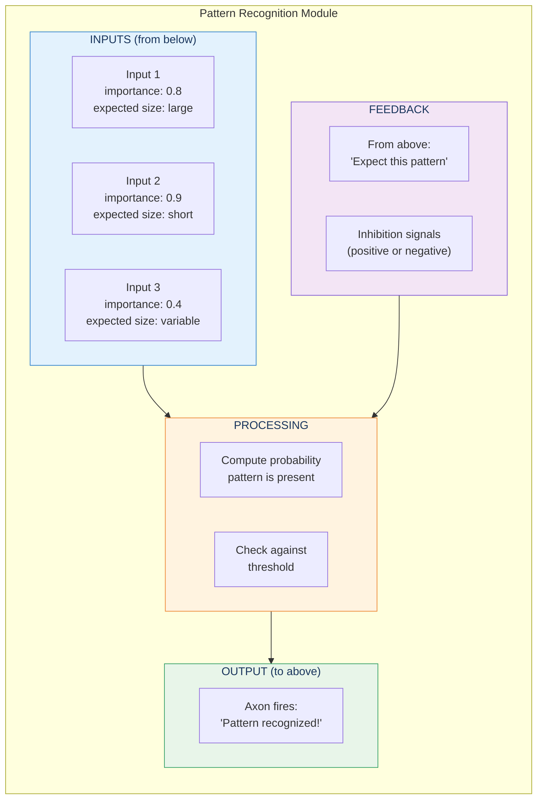
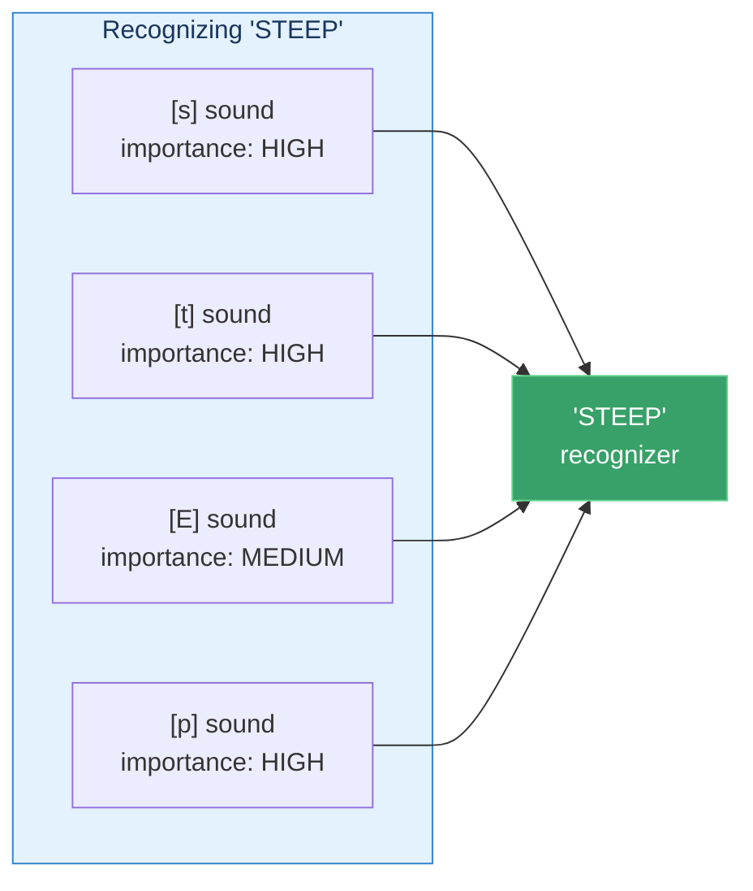
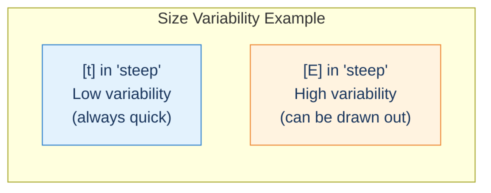
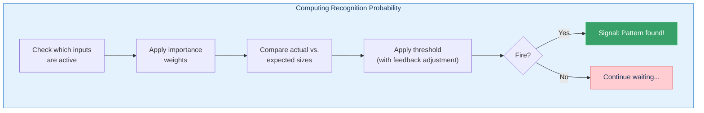
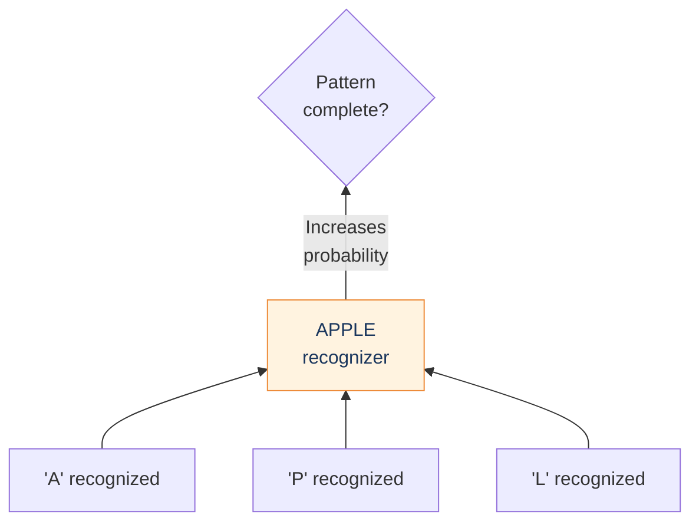
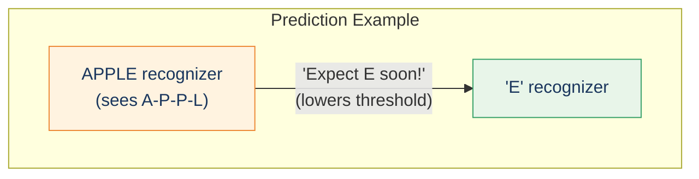
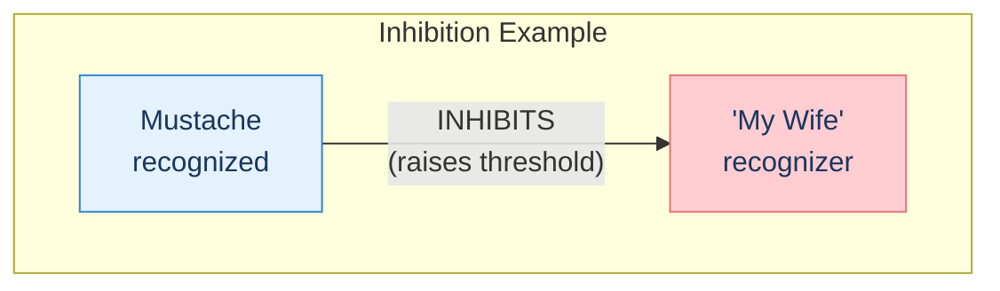
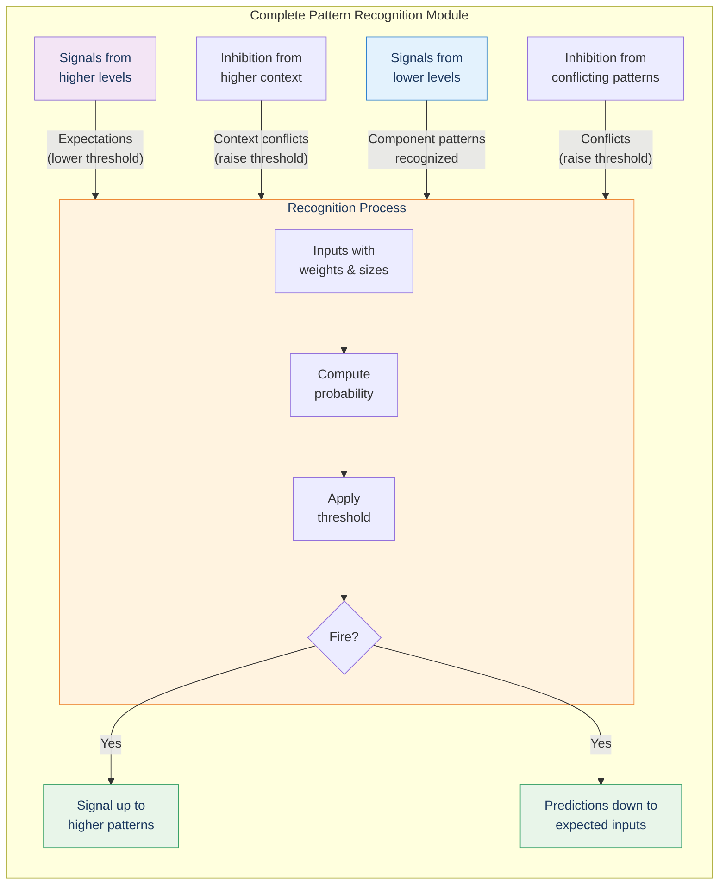

# The Pattern Recognizer Module

> "The operating principle of the neocortex is arguably the most important idea in the world, as it is capable of representing all knowledge and skills as well as creating new knowledge."

## The Core Insight

Each of the ~300 million pattern recognizers in the neocortex follows the same basic structure. Understanding this structure is key to understanding how the brain thinks.

## Anatomy of a Pattern Recognizer

## The Parameters

Each input to a pattern recognizer has three parameters:

### 1. Importance (Weight)

How critical is this input for recognizing the pattern?

### 2. Expected Size

What magnitude (duration, spatial extent, etc.) should this input have?

| Phoneme | Type | Expected Duration |
|---------|------|-------------------|
| [t] | Dental consonant | Very short |
| [p] | Plosive consonant | Very short |
| [s] | Sibilant | Short to medium |
| [E] | Long vowel | Long |

### 3. Size Variability

How much can the size vary while still being recognized?

## Probability Computation

The pattern recognizer computes the probability that its pattern is present:

## Bidirectional Signals

### Bottom-Up: Recognition

When lower-level patterns are recognized, they send signals up:

### Top-Down: Prediction

When a pattern is likely, it sends predictions down:

This is why we can read degraded or ambiguous text—our expectations fill in the gaps!

## Inhibitory Signals

Not all signals are positive. Inhibitory signals say "this pattern is LESS likely":

Inhibition can come from:
- **Below**: Conflicting features (mustache → probably not wife)
- **Above**: Contextual knowledge (wife is on a trip → person can't be her)

## The Full Picture

## Hidden Markov Models

Kurzweil notes that this computation is mathematically similar to **Hierarchical Hidden Markov Models (HMMs)**, which he used in his speech recognition work. The brain and successful AI systems use similar mathematical approaches!

## Key Takeaways

1. **Three parameters per input** — Importance, expected size, size variability
2. **Probability-based decisions** — Not binary; computes likelihood
3. **Bidirectional flow** — Recognition up, prediction down
4. **Inhibition matters** — Conflicting evidence raises thresholds
5. **Threshold adjustment** — Expectations lower thresholds; conflicts raise them
6. **Same algorithm everywhere** — This module is repeated 300 million times

## Think About It

- How does prediction (top-down) help us function in noisy environments?
- Why is probability-based recognition better than exact matching?
- How might inhibition prevent hallucinations and false recognitions?

## Related

- **Previous:** [Hierarchy of Patterns](/chapters/03-pattern-recognition-theory/hierarchy/)
- **Next:** [Learning](/chapters/03-pattern-recognition-theory/learning/)
- **Concept:** [Pattern Recognition Theory](/concepts/prtm/)
