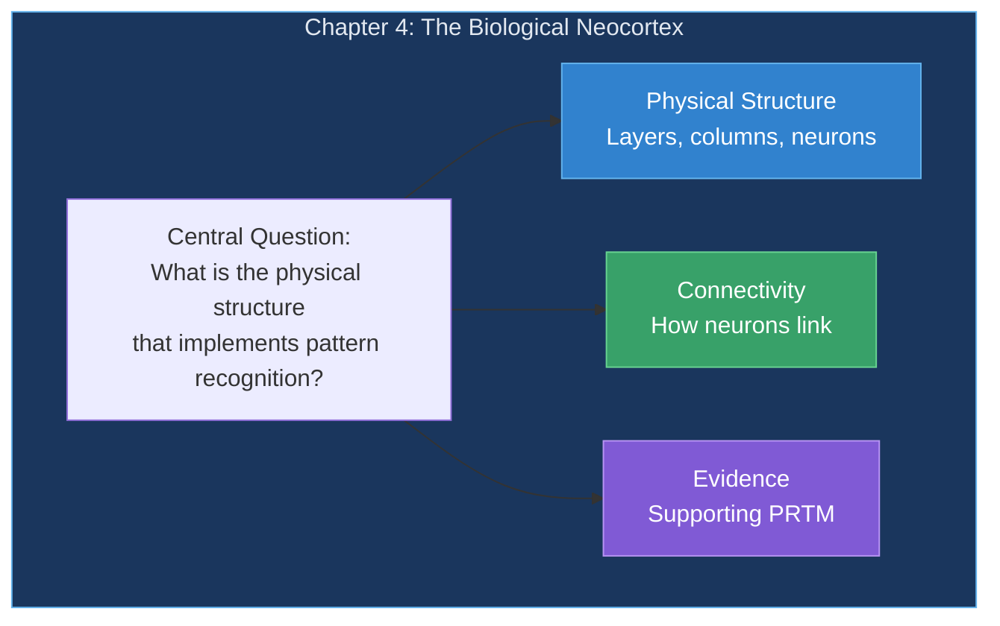
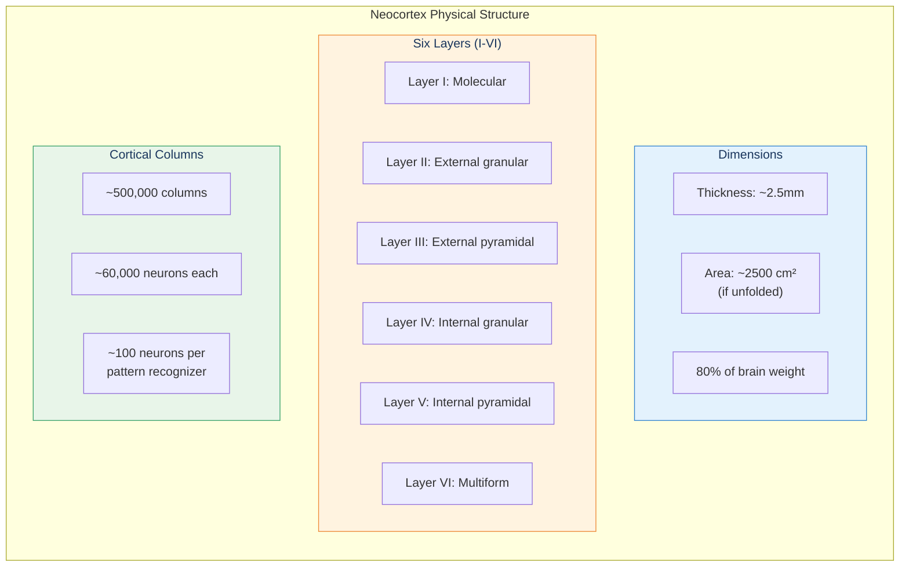
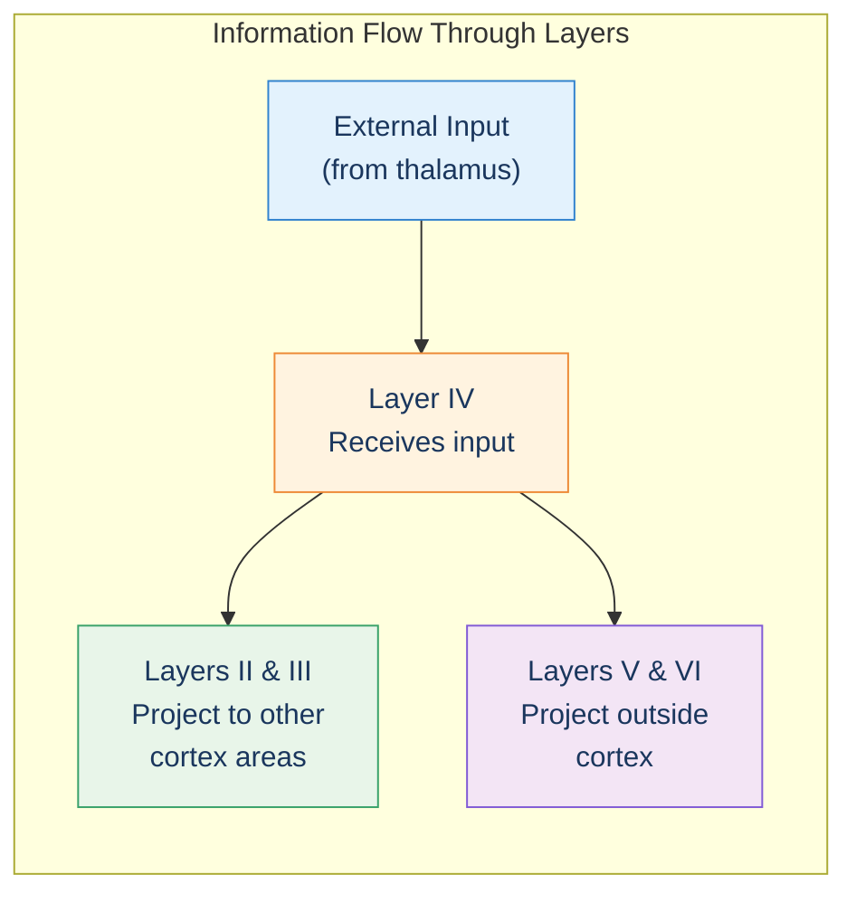
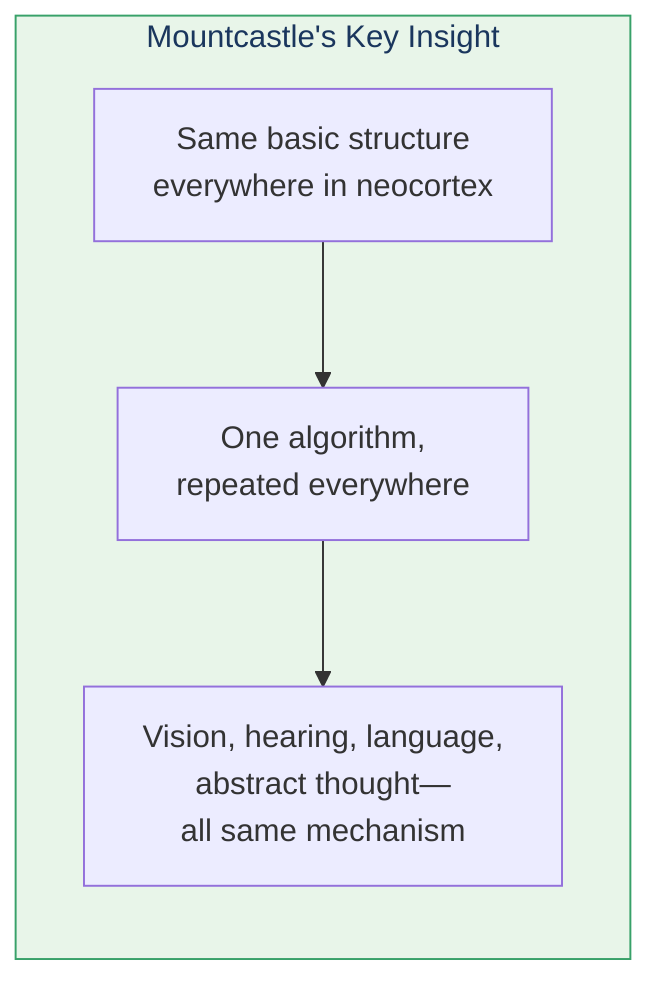
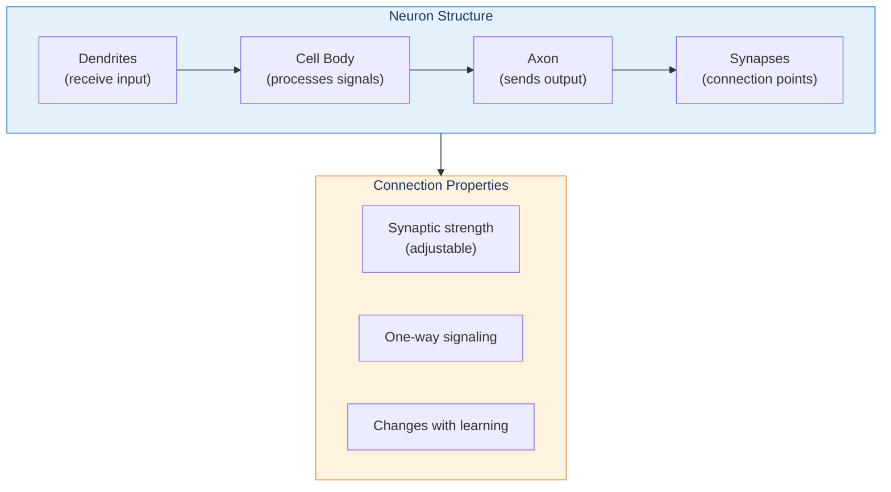

# Chapter 4: The Biological Neocortex

> "The brain is just the weight of God—For—Heft them—Pound for Pound" — Emily Dickinson

This chapter examines the actual biological structure of the neocortex—the thin layer responsible for all higher thought.

## Chapter Overview

## Neocortex Anatomy

## The Key Numbers

| Measure | Value |
|---------|-------|
| Neocortex thickness | ~2.5 mm |
| Cortical columns | ~500,000 |
| Neurons per column | ~60,000 |
| Total neocortex neurons | ~30 billion |
| Pattern recognizers | ~300 million |
| Neurons per recognizer | ~100 |

## Layer Functions

## Mountcastle's Discovery

Vernon Mountcastle made a crucial observation in 1978: **the neocortex has remarkably uniform structure**.

## Neurons and Connections

## Evidence for PRTM

Kurzweil presents multiple lines of evidence:

1. **Uniformity** — Same structure suggests same algorithm
2. **Plasticity** — Cortex regions can take over other functions
3. **Hierarchy** — Information flows up through layers
4. **Timing** — Recognition takes ~100ms (time for signals to traverse layers)

## Key Takeaways

1. **Thin but powerful** — 2.5mm layer does all higher thinking
2. **Uniform structure** — Same algorithm everywhere
3. **Six layers** — With distinct input/output roles
4. **300 million recognizers** — Each with ~100 neurons
5. **Plasticity** — Regions can adapt to new functions

## Think About It

- Why would evolution favor uniform structure over specialized circuits?
- How does the thinness of the neocortex affect its processing?
- What does plasticity suggest about the nature of the algorithm?

## Related

- **Previous:** [Chapter 3: Learning](/chapters/03-pattern-recognition-theory/learning/)
- **Next:** [Chapter 5: The Old Brain](/chapters/05-old-brain/overview/)
- **Concept:** [The Neocortex](/concepts/neocortex/)
