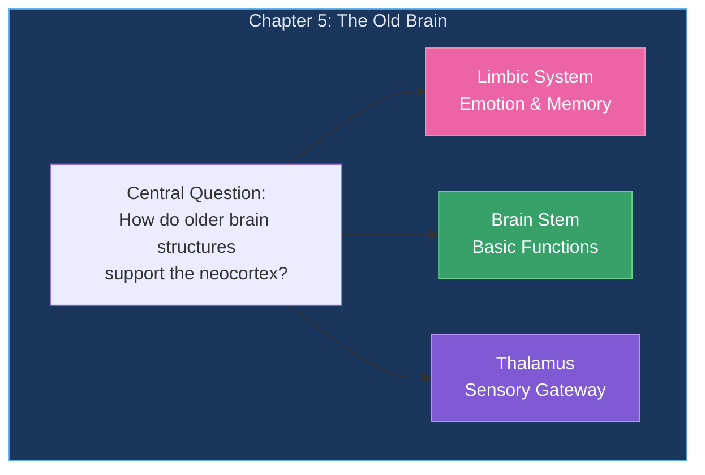
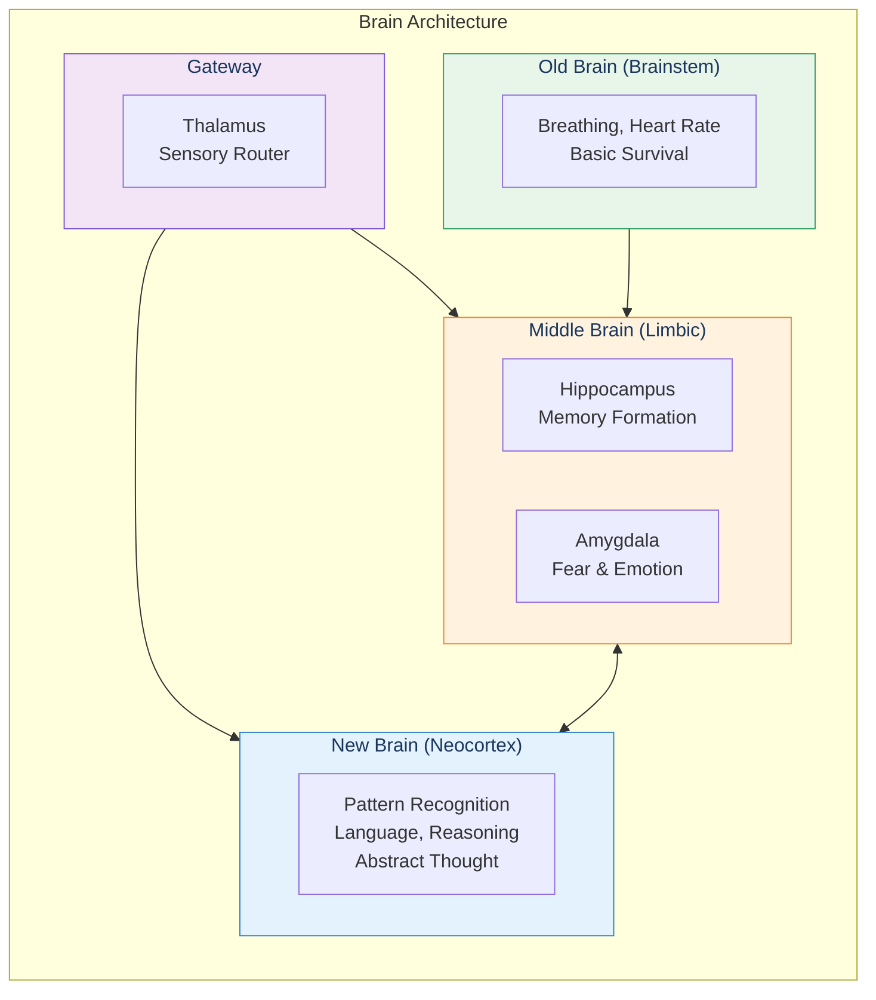
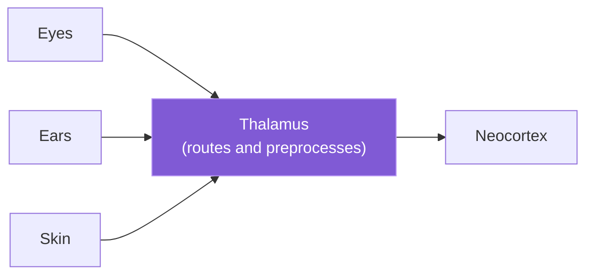
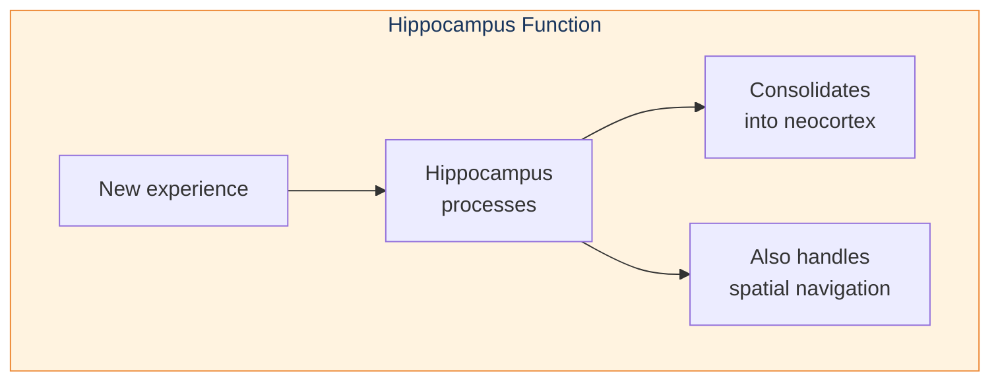
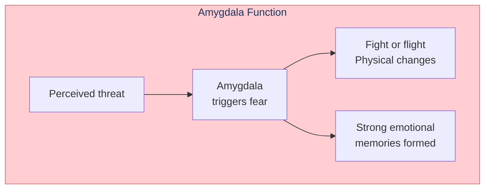
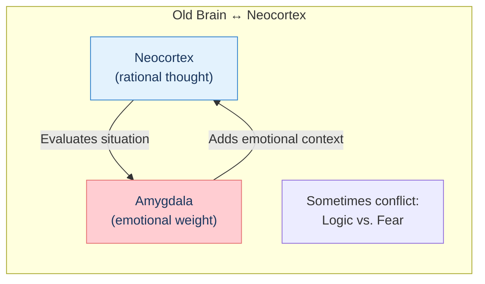

# Chapter 5: The Old Brain

The neocortex doesn't work alone. Ancient brain structures—the "old brain"—provide essential functions for survival, emotion, and memory.

## Chapter Overview

## The Brain's Architecture

## Key Structures

### The Thalamus: Sensory Gateway

### The Hippocampus: Memory Formation

### The Amygdala: Emotion & Fear

## Interaction with Neocortex

## Key Takeaways

1. **Layered evolution** — New brain built on top of old
2. **Thalamus as gateway** — Routes all sensory input
3. **Hippocampus for memory** — Essential for forming new memories
4. **Amygdala for emotion** — Colors thoughts with feeling
5. **Collaboration** — Old and new brain work together

## Related

- **Previous:** [Chapter 4: Biological Neocortex](/chapters/04-biological-neocortex/overview/)
- **Next:** [Chapter 6: Transcendent Abilities](/chapters/06-transcendent-abilities/overview/)
- **Concept:** [The Neocortex](/concepts/neocortex/)
