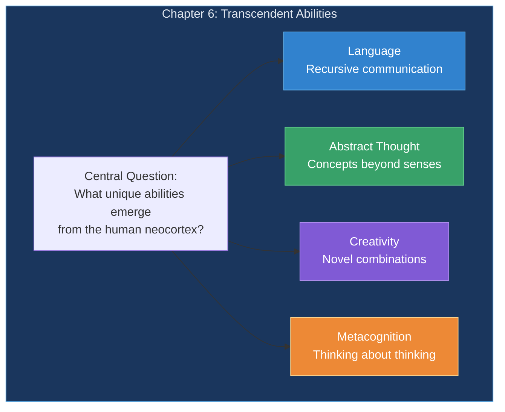
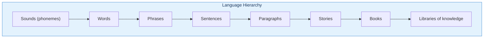
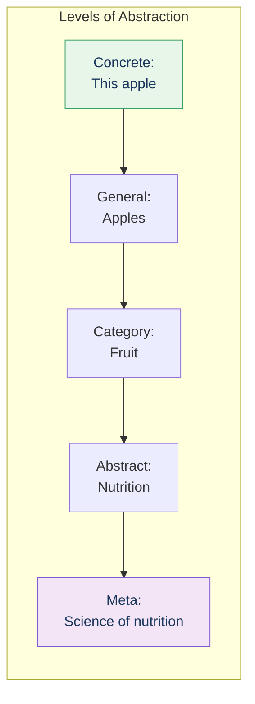
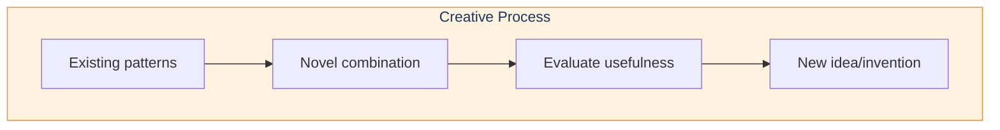
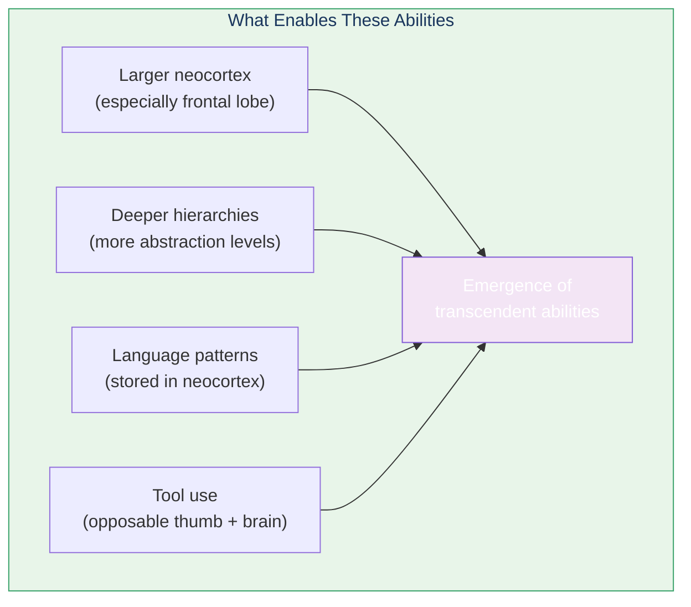

# Chapter 6: Transcendent Abilities

What makes human thinking special? Kurzweil explores the capabilities that emerge from our expanded neocortex.

## Chapter Overview

## Unique Human Capabilities

### Language: Recursive Hierarchy

Human language is **infinitely recursive**—we can embed concepts within concepts without limit.

### Abstract Thought

### Creativity: Novel Combinations

## What Makes This Possible

## Key Takeaways

1. **Language enables infinite expression** — Recursive hierarchy
2. **Abstraction builds on abstraction** — Multiple meta-levels
3. **Creativity combines patterns** — Novel but meaningful
4. **Metacognition** — We can think about our own thinking
5. **Tools extend capabilities** — Brain + hands = civilization

## Related

- **Previous:** [Chapter 5: The Old Brain](/chapters/05-old-brain/overview/)
- **Next:** [Chapter 7: Digital Neocortex](/chapters/07-digital-neocortex/overview/)
- **Concept:** [Hierarchical Learning](/concepts/hierarchical-learning/)
