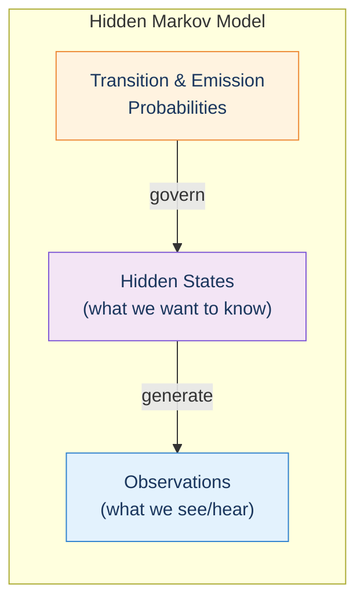
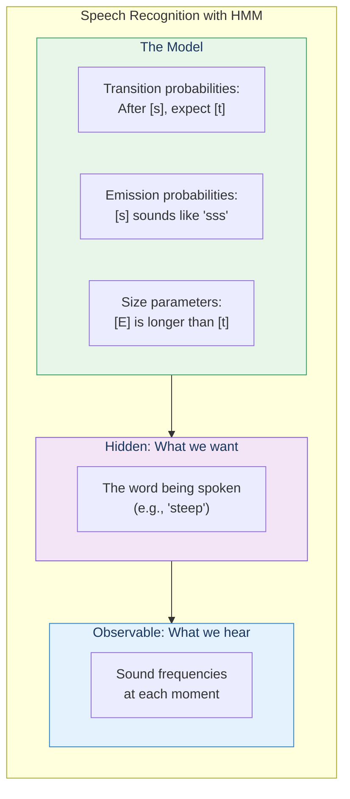
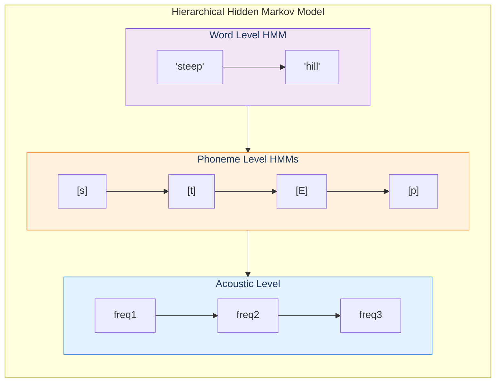
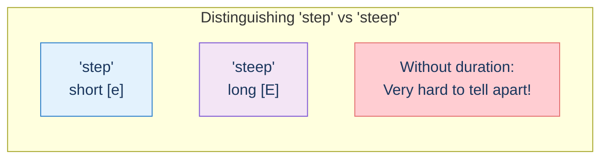

# Hidden Markov Models

Hidden Markov Models (HMMs) are the mathematical framework that Kurzweil used for speech recognition—and they mirror how pattern recognizers work in the brain.

## The Core Idea

## Speech Recognition Example

## Parallel to Brain Pattern Recognizers

| Brain | HMM |
|-------|-----|
| Input importance weights | Emission probabilities |
| Expected size | State duration model |
| Size variability | Variance parameters |
| Top-down prediction | State transition probabilities |
| Threshold for firing | Recognition confidence threshold |

## Hierarchical HMMs

Just like the neocortex, HMMs work best when organized hierarchically:

## Why Duration Matters

Kurzweil discovered that incorporating duration information was crucial:

## Key Takeaways

1. **HMMs model sequential patterns** — Perfect for speech, text, time series
2. **Hidden states from observations** — Infer what was said from sound
3. **Probabilities, not rules** — Statistical, not deterministic
4. **Hierarchy improves performance** — Multiple levels of abstraction
5. **Duration is critical** — Size parameters matter enormously

## Related

- **Previous:** [Chapter 7 Overview](/chapters/07-digital-neocortex/overview/)
- **Next:** [Chapter 8: Mind as Computer](/chapters/08-mind-as-computer/overview/)
- **Concept:** [Pattern Recognition Theory](/concepts/prtm/)
