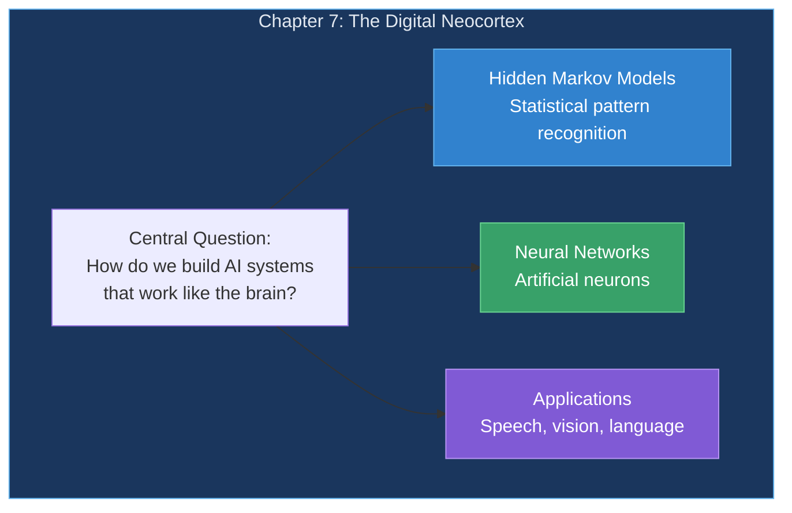
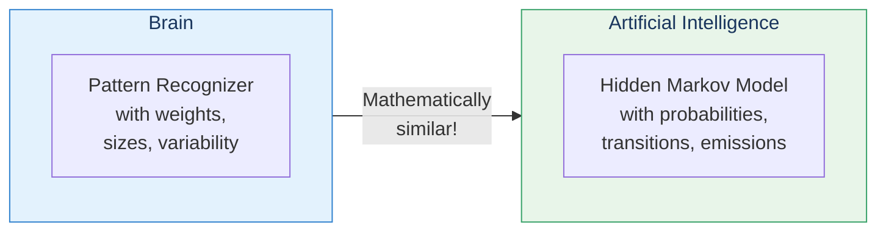
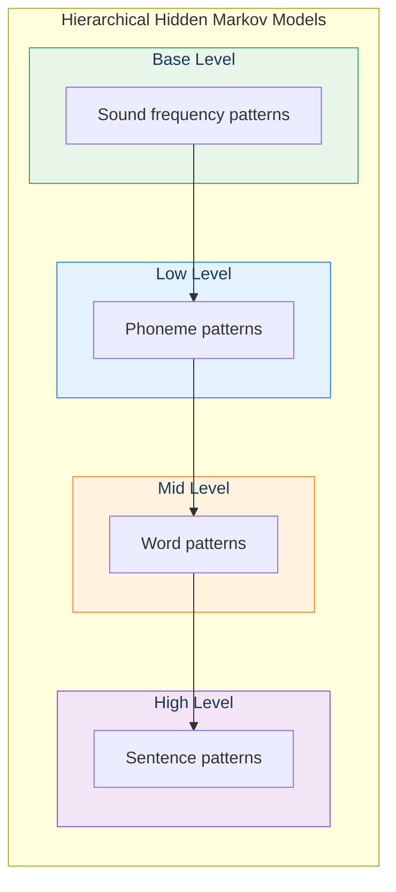
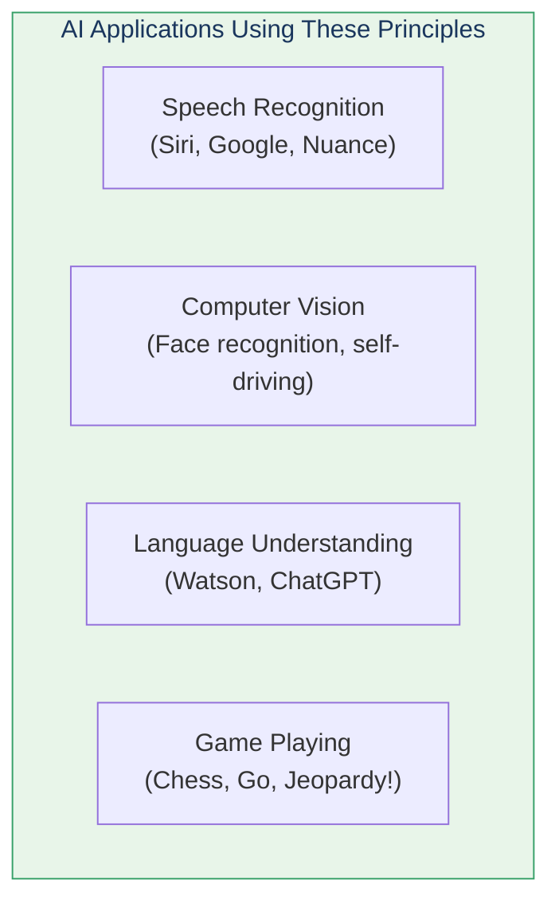
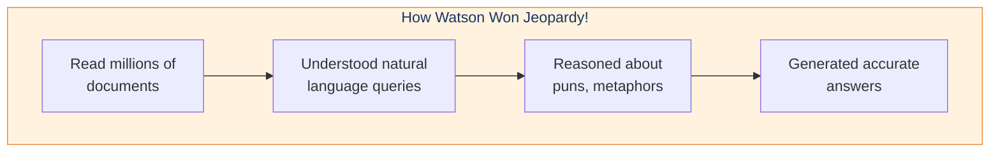
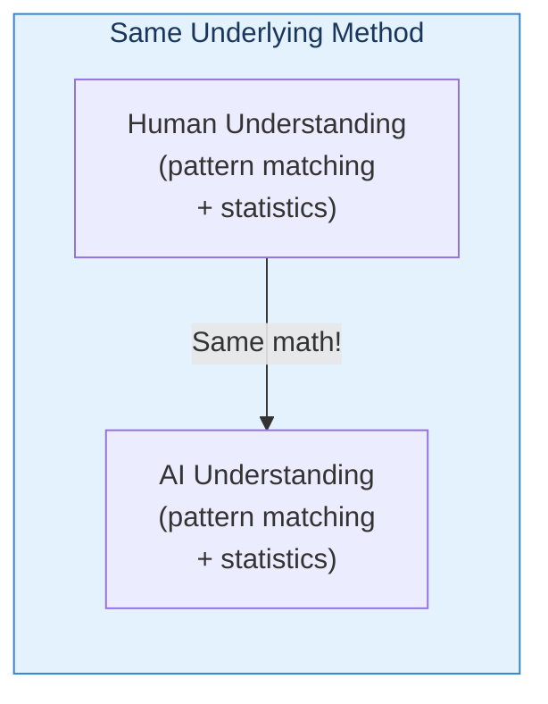

# Chapter 7: The Biologically Inspired Digital Neocortex

> "I believe that at the end of the century the use of words and general educated opinion will have altered so much that one will be able to speak of machines thinking without expecting to be contradicted." — Alan Turing

This chapter bridges neuroscience and artificial intelligence, showing how the principles of the neocortex inform AI systems.

## Chapter Overview

## The Connection to AI

Kurzweil shows that successful AI systems (like his speech recognition work) use methods mathematically similar to how the brain works:

## Sections in This Chapter

| Section | Title | Key Idea |
|---------|-------|----------|
| 7.1 | [Hidden Markov Models](/chapters/07-digital-neocortex/hmm/) | Statistical sequence recognition |
| 7.2 | Neural Networks | Artificial neuron systems |
| 7.3 | Deep Learning | Multiple hierarchical layers |
| 7.4 | Applications | Speech, vision, Watson |

## Hierarchical Hidden Markov Models

The key technique Kurzweil developed for speech recognition:

## Real-World Applications

### Watson on Jeopardy!

## The Key Insight

If critics say Watson doesn't "really understand" because it's "just statistics"—well, the brain also uses statistical pattern matching!

## Key Takeaways

1. **Brain and AI use similar math** — HMMs mirror pattern recognizers
2. **Hierarchy is essential** — Levels of abstraction in both
3. **Statistics, not rules** — Probabilistic matching
4. **Already working today** — Speech, vision, language AI
5. **Understanding is pattern matching** — For both humans and machines

## Think About It

- If understanding is statistical pattern matching, what does that mean for consciousness?
- How might future AI systems be even more brain-like?
- What's the difference between "seeming to understand" and "actually understanding"?

## Related

- **Previous:** [Chapter 6: Transcendent Abilities](/chapters/06-transcendent-abilities/overview/)
- **Next:** [Hidden Markov Models](/chapters/07-digital-neocortex/hmm/)
- **Concept:** [Pattern Recognition Theory](/concepts/prtm/)
