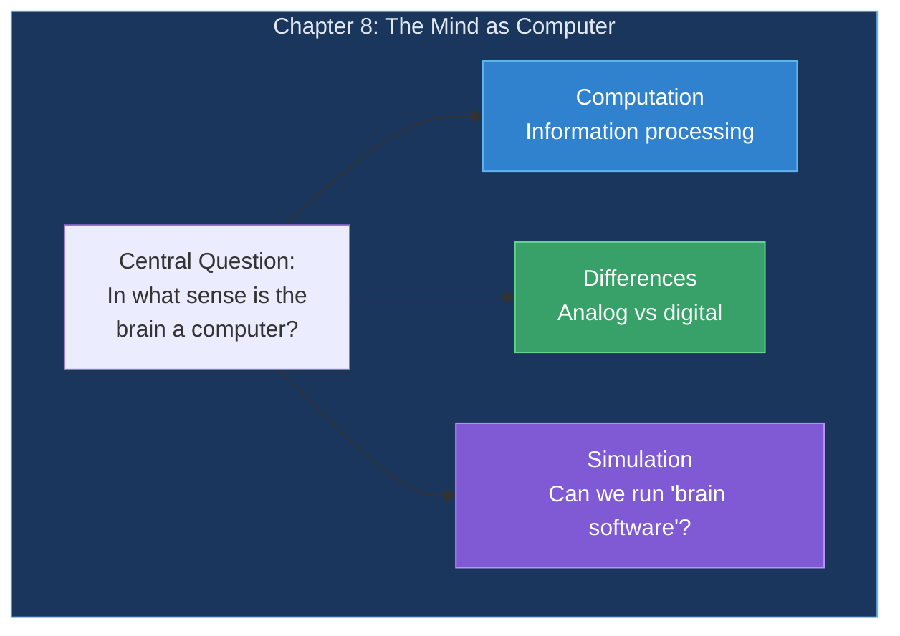
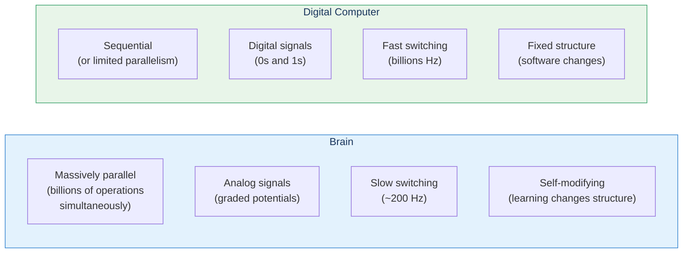
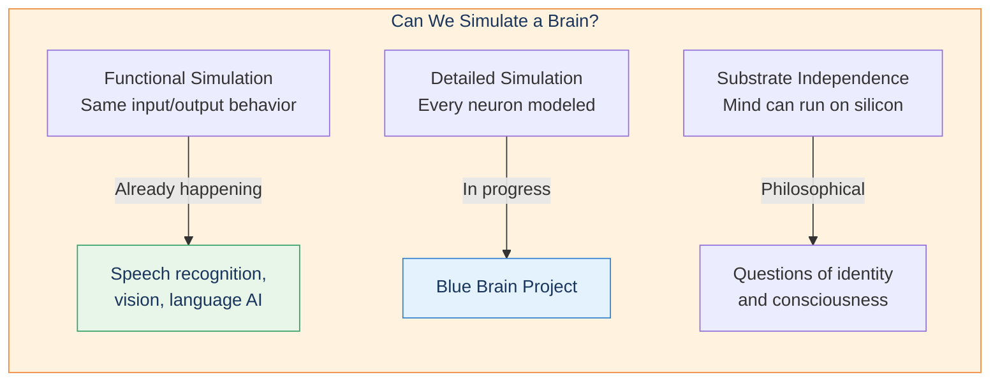

# Chapter 8: The Mind as Computer

Is the brain a computer? Kurzweil argues that at its core, the brain is an information-processing system—albeit one far more parallel and analog than our digital computers.

## Chapter Overview

## Brain vs Computer

## Key Comparison

| Aspect | Brain | Computer |
|--------|-------|----------|
| Operations/sec | 10^16 (parallel) | 10^9-10^12 (sequential) |
| Memory | 10^14 synapses | 10^10-10^12 bits |
| Clock speed | ~200 Hz | ~10^9 Hz |
| Power | ~20 watts | 100-500 watts |
| Learning | Continuous | Requires reprogramming |

## The Simulation Question

## Key Takeaways

1. **Both are information processors** — Fundamentally similar
2. **Different architectures** — Parallel analog vs sequential digital
3. **Functional equivalence possible** — Same computation, different substrate
4. **Simulation is feasible** — With enough computing power
5. **Deep questions remain** — About consciousness and identity

## Related

- **Previous:** [Chapter 7: Digital Neocortex](/chapters/07-digital-neocortex/overview/)
- **Next:** [Chapter 9: Thought Experiments on the Mind](/chapters/09-thought-experiments-mind/overview/)
- **Concept:** [Consciousness](/concepts/consciousness/)
