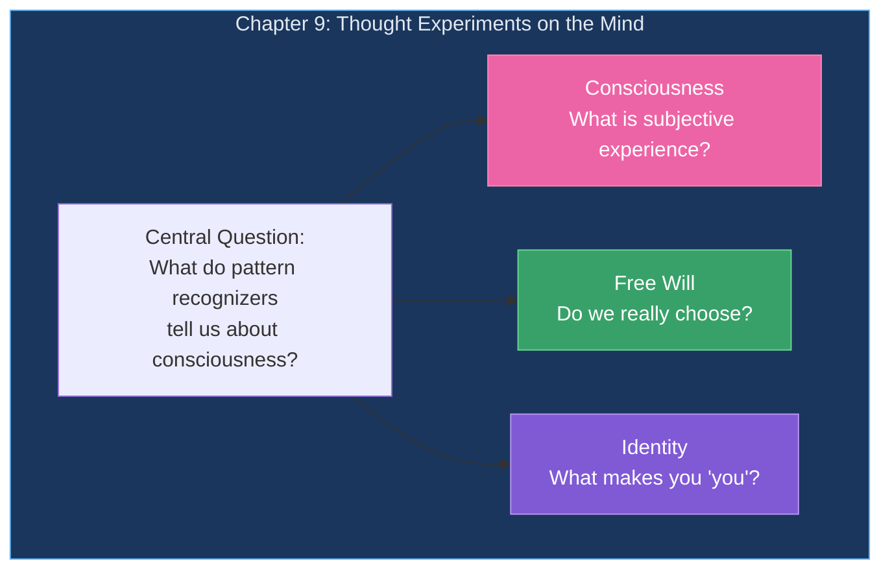
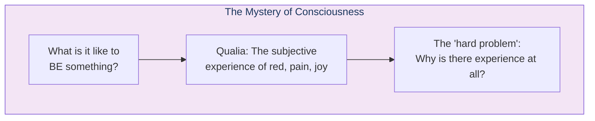
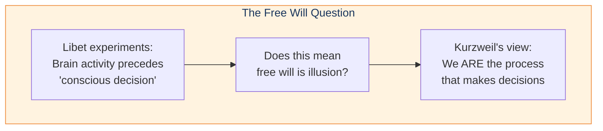
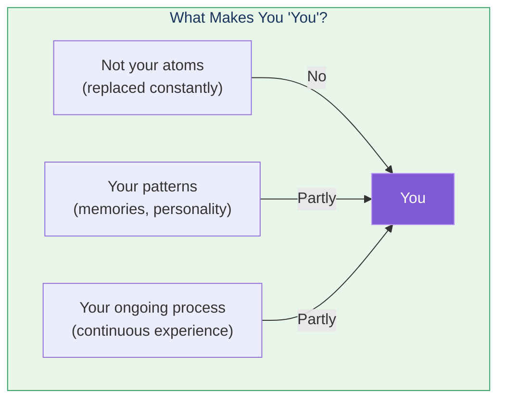
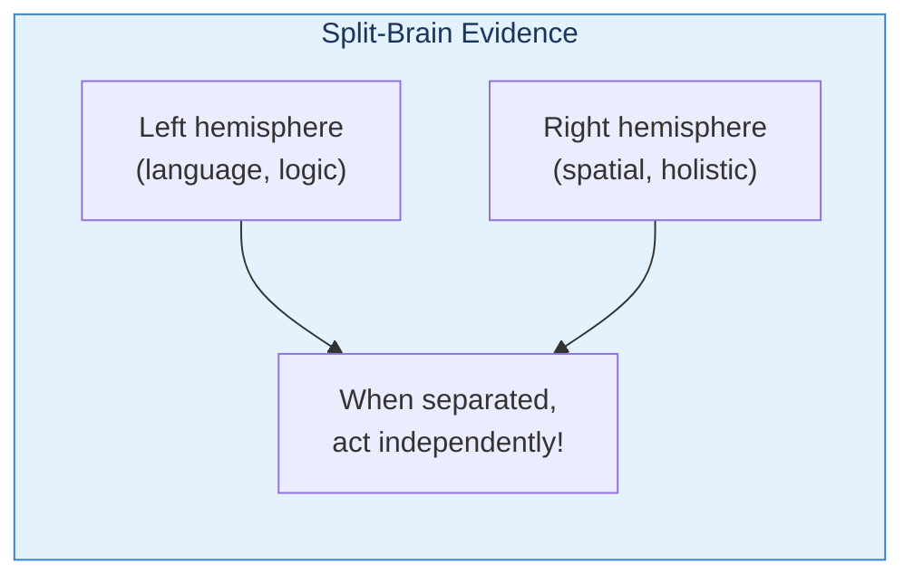

# Chapter 9: Thought Experiments on the Mind

Having established how the neocortex works, Kurzweil now tackles the deepest questions: consciousness, free will, and personal identity.

## Chapter Overview

## Consciousness

Kurzweil suggests consciousness may emerge from the recursive, self-modeling nature of the neocortex—we have patterns that recognize patterns about ourselves.

## Free Will

## Identity

## Multiple Minds?

Split-brain patients suggest we may have multiple "minds":

## Key Takeaways

1. **Consciousness remains mysterious** — But may emerge from self-modeling
2. **Free will is complex** — We ARE the decision-making process
3. **Identity is in patterns** — Not atoms or specific neurons
4. **Multiple "selves" possible** — Split-brain evidence
5. **Deep questions remain** — PRTM provides framework but not all answers

## Related

- **Previous:** [Chapter 8: Mind as Computer](/chapters/08-mind-as-computer/overview/)
- **Next:** [Chapter 10: Law of Accelerating Returns](/chapters/10-law-accelerating-returns/overview/)
- **Concept:** [Consciousness](/concepts/consciousness/)
