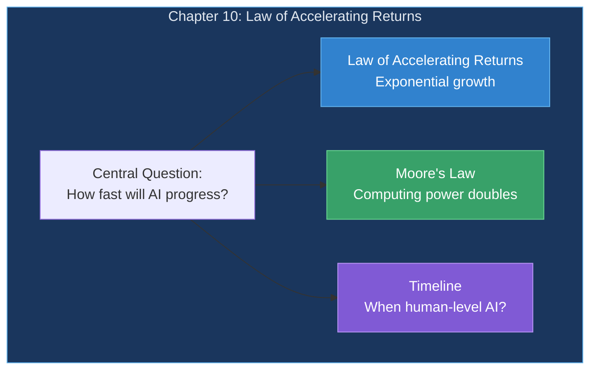
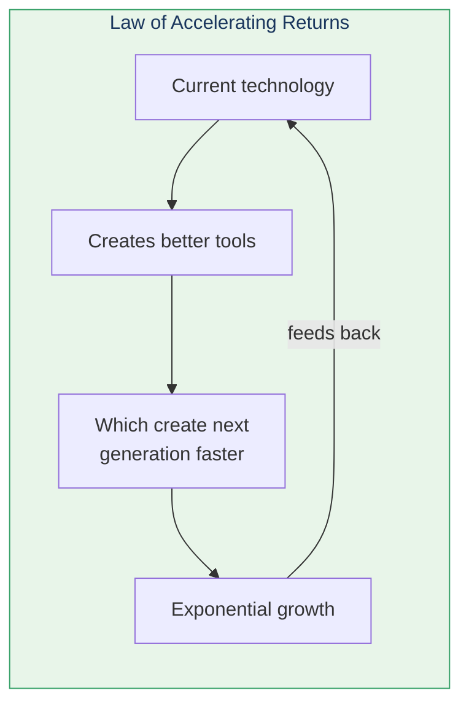
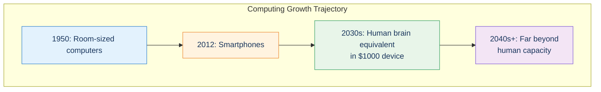

# Chapter 10: The Law of Accelerating Returns

> "An evolutionary process inherently accelerates as a result of its increasing levels of abstraction."

Kurzweil's Law of Accelerating Returns (LOAR) predicts that technology grows exponentially—and this has profound implications for brain-inspired AI.

## Chapter Overview

## The Law of Accelerating Returns

## Computing Power Growth

## Brain Reverse Engineering Progress

| Metric | Growth Rate |
|--------|-------------|
| Brain scan resolution | Doubling yearly |
| Genetic sequencing | Doubling yearly |
| Brain simulation fidelity | Doubling ~18 months |
| AI capability | Exponential |

## Implications

## Key Takeaways

1. **Technology grows exponentially** — Not linearly
2. **Each advance enables faster advances** — Positive feedback
3. **Brain reverse engineering accelerating** — Scan resolution, simulation
4. **Human-level AI predictable** — Based on trends
5. **Then rapid advancement beyond** — The Singularity

## Related

- **Previous:** [Chapter 9: Thought Experiments on the Mind](/chapters/09-thought-experiments-mind/overview/)
- **Next:** [Chapter 11: Objections](/chapters/11-objections/overview/)
- **Concept:** [Law of Accelerating Returns](/concepts/loar/)
