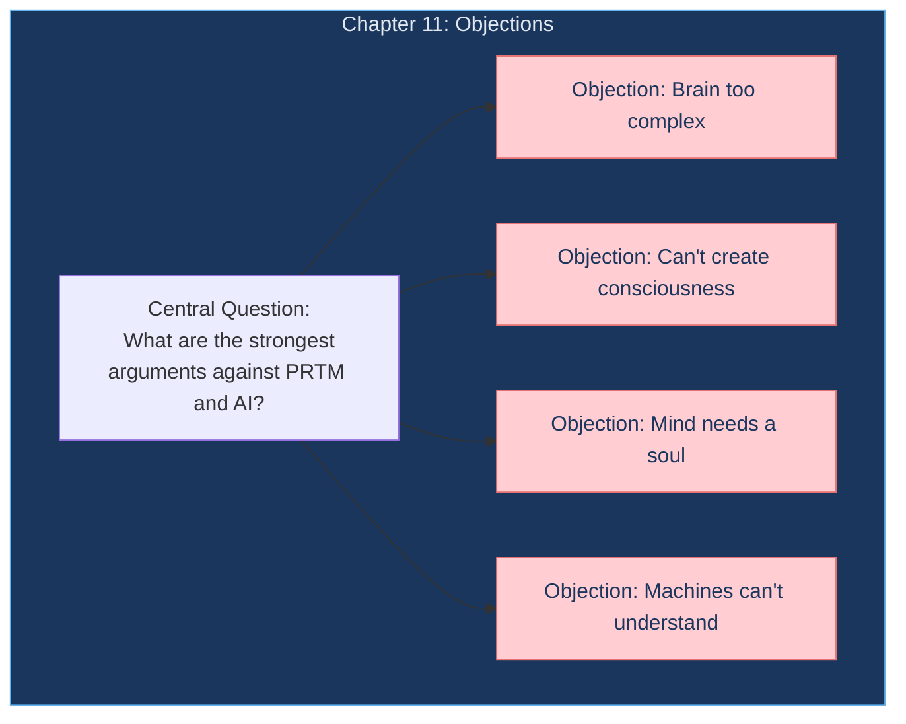
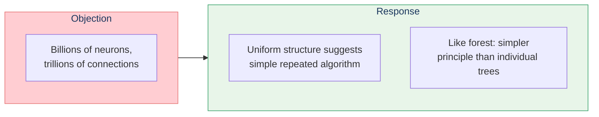
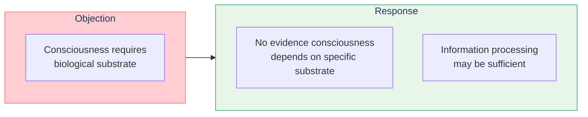
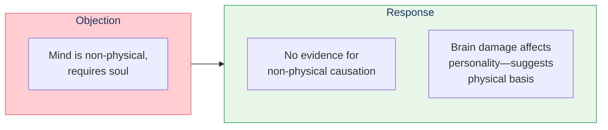
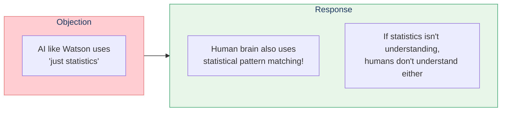
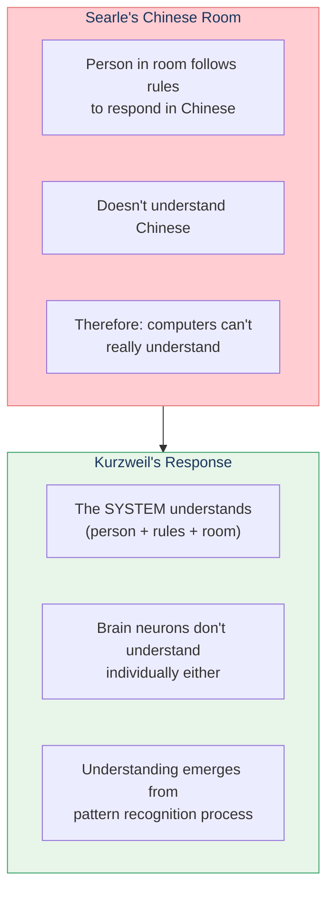

# Chapter 11: Objections

Kurzweil addresses common objections to both the Pattern Recognition Theory of Mind and the prospect of creating artificial minds.

## Chapter Overview

## Major Objections and Responses

### 1. "The brain is too complex to understand"

### 2. "Machines can't be conscious"

### 3. "The mind needs a soul"

### 4. "It's just statistics, not understanding"

## The Chinese Room Argument

## Key Takeaways

1. **Complexity doesn't preclude understanding** — Uniform principles underlie complex systems
2. **Consciousness may be substrate-independent** — Information processing, not biology
3. **No evidence for non-physical mind** — Brain damage affects mind
4. **Statistics IS how understanding works** — In both brains and machines
5. **Understanding is systemic** — Emerges from pattern recognition process

## Related

- **Previous:** [Chapter 10: Law of Accelerating Returns](/chapters/10-law-accelerating-returns/overview/)
- **Concept:** [Consciousness](/concepts/consciousness/)
- **Concept:** [Pattern Recognition Theory](/concepts/prtm/)
