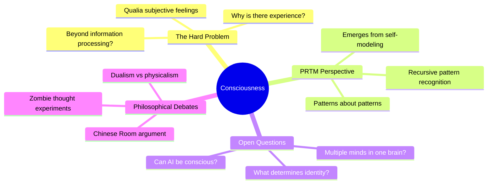
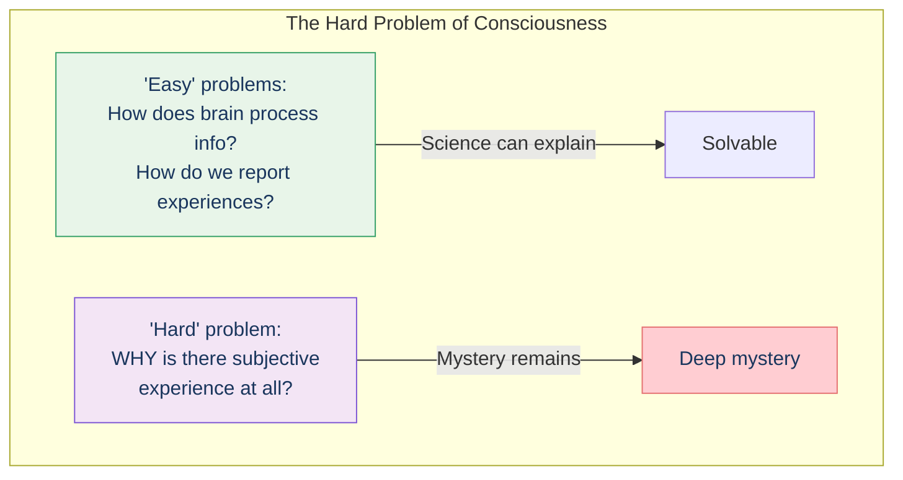
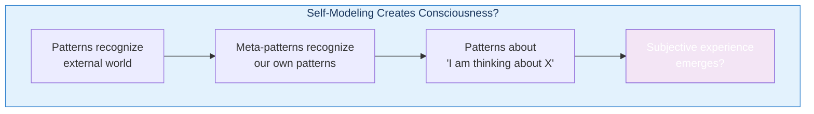
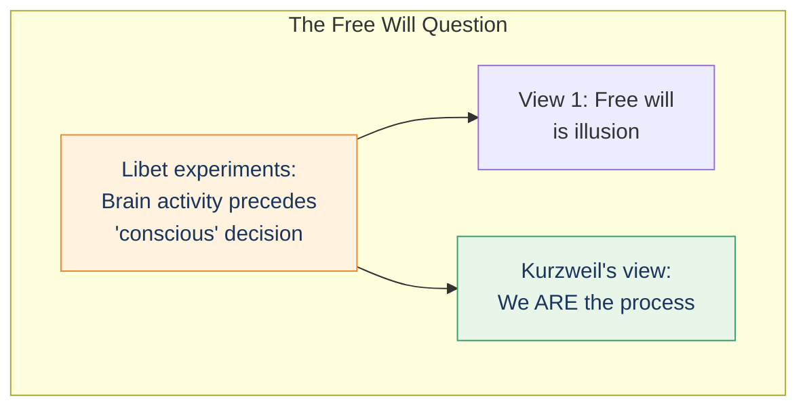
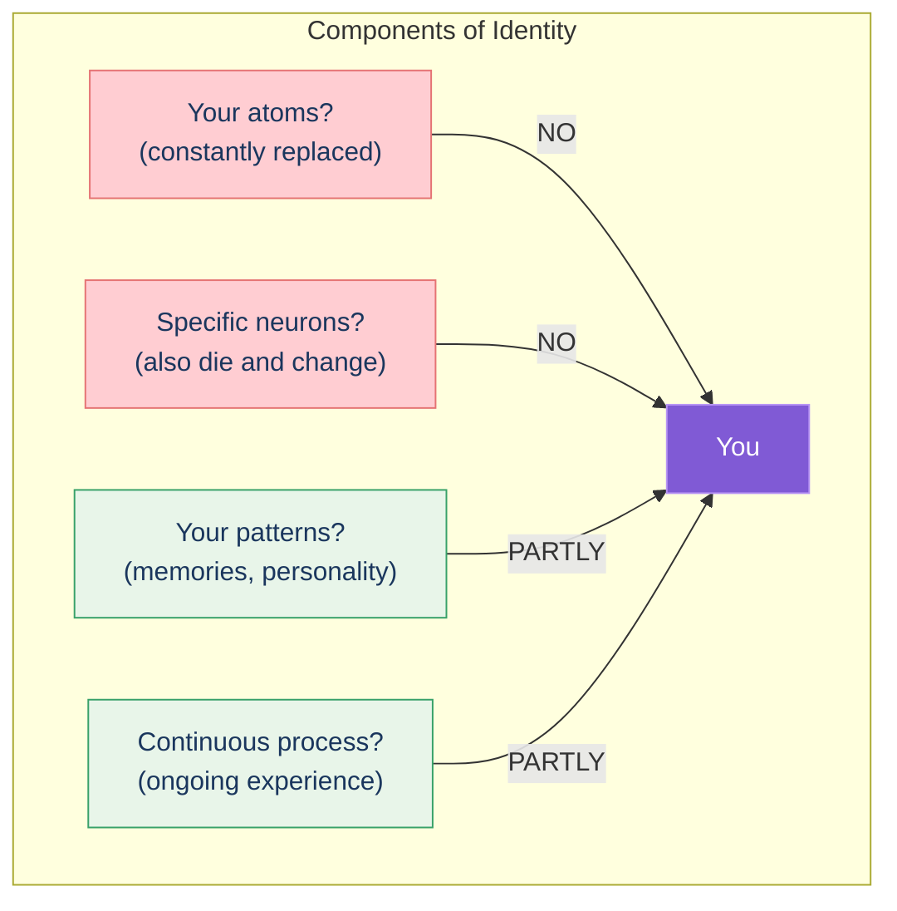
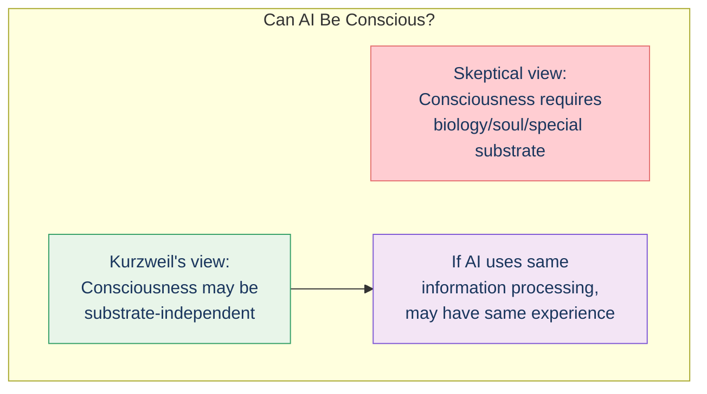

# Consciousness

Consciousness—subjective, first-person experience—remains one of the deepest mysteries in science. Kurzweil explores what the Pattern Recognition Theory of Mind suggests about its nature.

## Concept Overview

## The Hard Problem

## What PRTM Suggests

Kurzweil suggests consciousness may emerge from the neocortex's ability to model itself:

## Free Will

## Identity

What makes you "you"?

## Can AI Be Conscious?

## Where This Appears in the Book

| Chapter | Context | Key Insight |
|---------|---------|-------------|
| [Ch 8](/chapters/08-mind-as-computer/overview/) | Mind as computer | Computation and consciousness |
| [Ch 9](/chapters/09-thought-experiments-mind/overview/) | **Main coverage** | Deep questions explored |
| [Ch 11](/chapters/11-objections/overview/) | Objections | Responses to skeptics |

## Related Concepts

- [Pattern Recognition Theory](/concepts/prtm/) — The mechanism that may produce consciousness
- [The Neocortex](/concepts/neocortex/) — The physical substrate
- [Law of Accelerating Returns](/concepts/loar/) — When might AI consciousness emerge?

## Learn More

- **Chapter**: [Thought Experiments on the Mind](/chapters/09-thought-experiments-mind/overview/)
- **Chapter**: [Objections](/chapters/11-objections/overview/)
