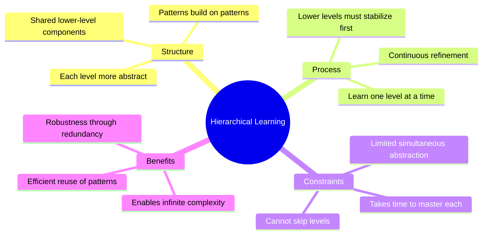
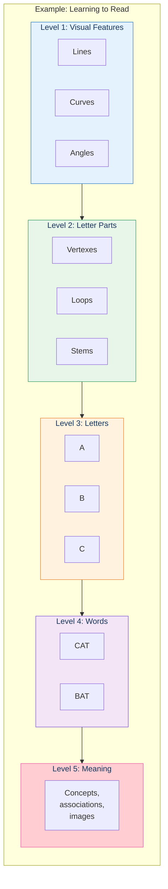
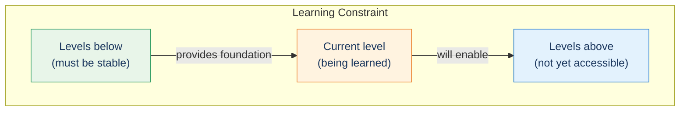
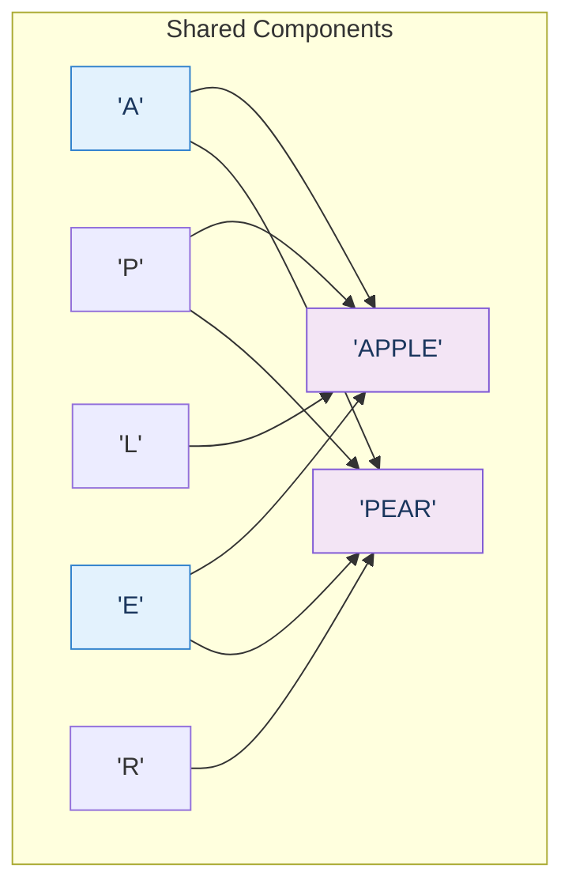
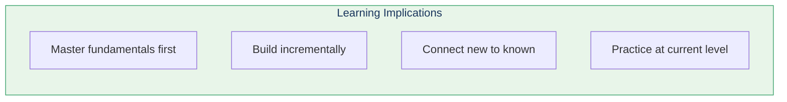

# Hierarchical Learning

Hierarchical learning is the process by which simpler patterns combine to form more complex patterns, which then combine to form even more complex patterns—creating the layered structure of human knowledge.

## Concept Overview

## The Hierarchy in Action

## The One-Level-at-a-Time Constraint

A crucial insight: **we can only learn one or two conceptual levels at a time**.

This explains why:
- Infants must learn basic shapes before letters
- Children learn arithmetic before algebra
- Expertise takes years (many levels to master)

## Sharing Lower Levels

Different high-level concepts share lower-level patterns:

This is why:
- Learning one thing helps learn related things
- Expertise in one domain transfers partially to others
- General education improves specialized learning

## Where This Appears in the Book

| Chapter | Context | Key Insight |
|---------|---------|-------------|
| [Ch 1](/chapters/01-thought-experiments-world/overview/) | Darwin/Lyell | Simple processes create complex outcomes |
| [Ch 3](/chapters/03-pattern-recognition-theory/hierarchy/) | **Main coverage** | Hierarchy of patterns |
| [Ch 3](/chapters/03-pattern-recognition-theory/learning/) | Learning | One level at a time |
| [Ch 6](/chapters/06-transcendent-abilities/overview/) | Language | Recursive hierarchy enables infinite expression |

## Implications for Learning

## Related Concepts

- [Pattern Recognition Theory](/concepts/prtm/) — The mechanism that enables hierarchy
- [The Neocortex](/concepts/neocortex/) — The physical substrate
- [Law of Accelerating Returns](/concepts/loar/) — Why learning compounds

## Learn More

- **Chapter**: [Hierarchy of Patterns](/chapters/03-pattern-recognition-theory/hierarchy/)
- **Chapter**: [Learning](/chapters/03-pattern-recognition-theory/learning/)
