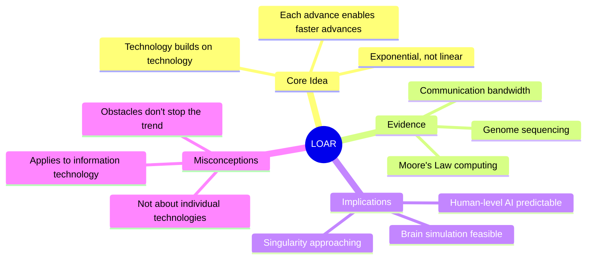
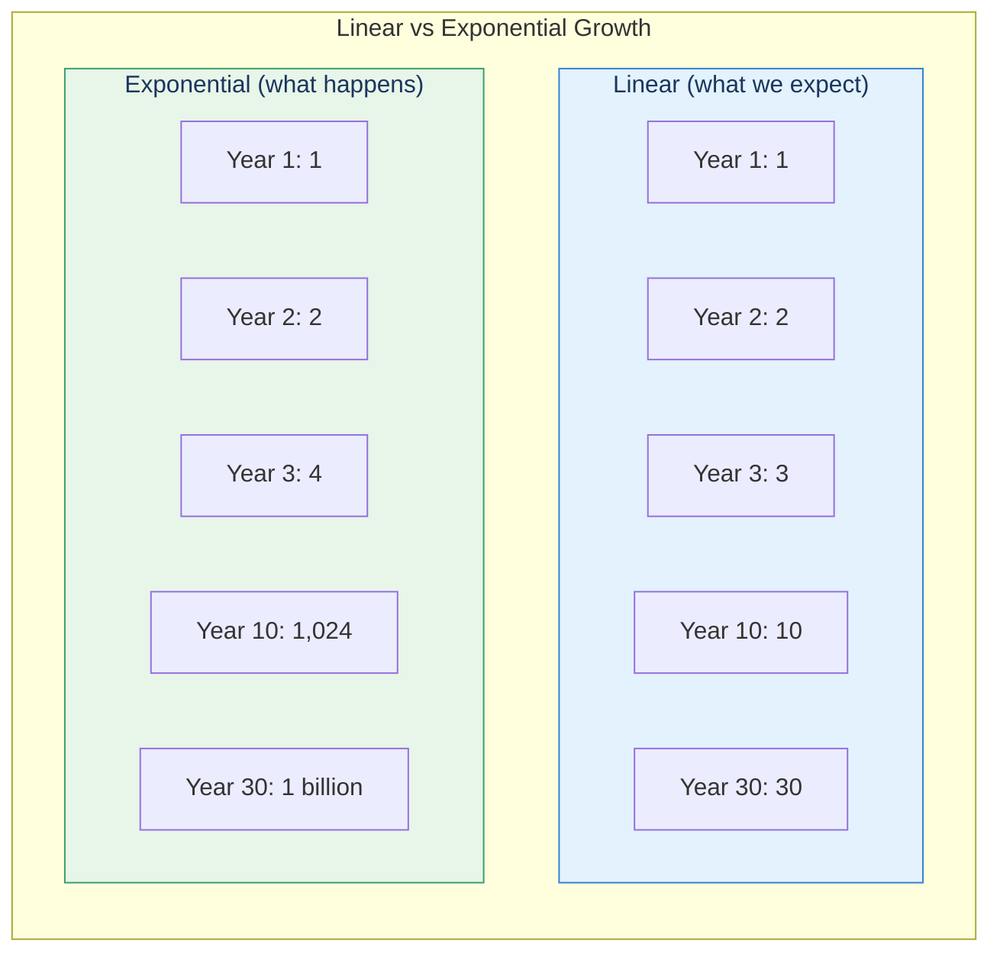
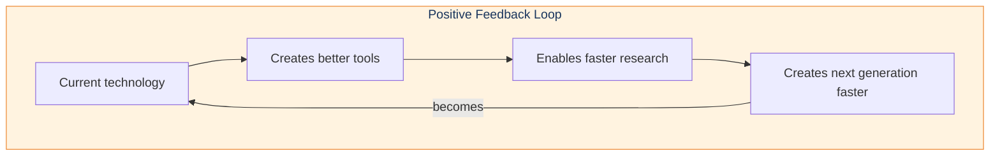
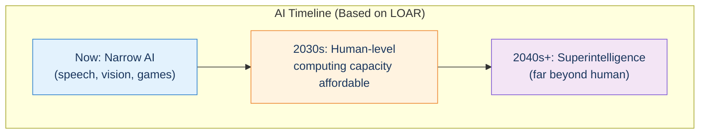
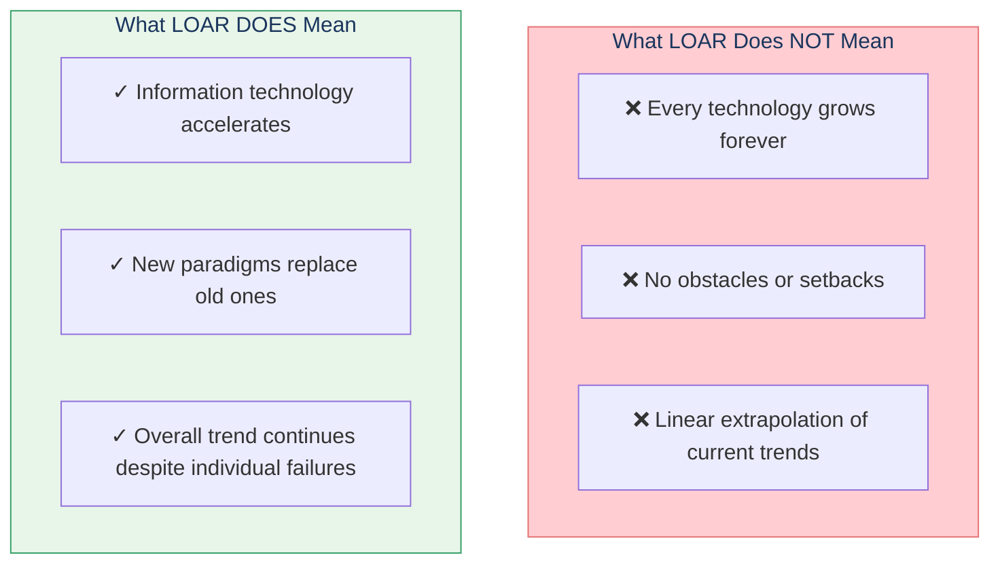

# Law of Accelerating Returns (LOAR)

The Law of Accelerating Returns is Kurzweil's principle that evolutionary processes—including technological development—inherently accelerate, leading to exponential rather than linear growth.

## Concept Overview

## Linear vs Exponential

## Why It Accelerates

## Examples

### Computing Power

| Year | Computing (FLOPS/$) |
|------|---------------------|
| 1950 | 0.0001 |
| 1970 | 0.01 |
| 1990 | 1 |
| 2010 | 100,000 |
| 2020 | 10,000,000 |

### Genome Sequencing

| Year | Cost per Genome |
|------|-----------------|
| 2001 | $100,000,000 |
| 2007 | $10,000,000 |
| 2010 | $10,000 |
| 2020 | $300 |

## Implications for AI

## Where This Appears in the Book

| Chapter | Context | Key Insight |
|---------|---------|-------------|
| Introduction | Book's foundation | Technology accelerates |
| [Ch 7](/chapters/07-digital-neocortex/overview/) | AI progress | Steady advances in AI |
| [Ch 10](/chapters/10-law-accelerating-returns/overview/) | **Main coverage** | Full LOAR argument |

## Common Misconceptions

## Related Concepts

- [Pattern Recognition Theory](/concepts/prtm/) — What AI is learning to do
- [The Neocortex](/concepts/neocortex/) — The target of brain simulation
- [Consciousness](/concepts/consciousness/) — Will AI become conscious?

## Learn More

- **Chapter**: [Law of Accelerating Returns](/chapters/10-law-accelerating-returns/overview/)
- **Path**: [AI & Neuroscience](/paths/ai-neuroscience/)
