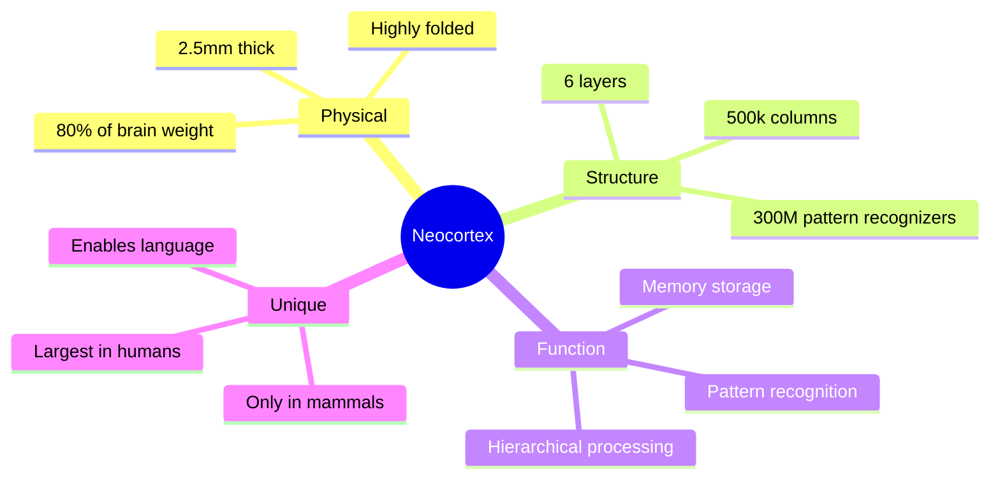
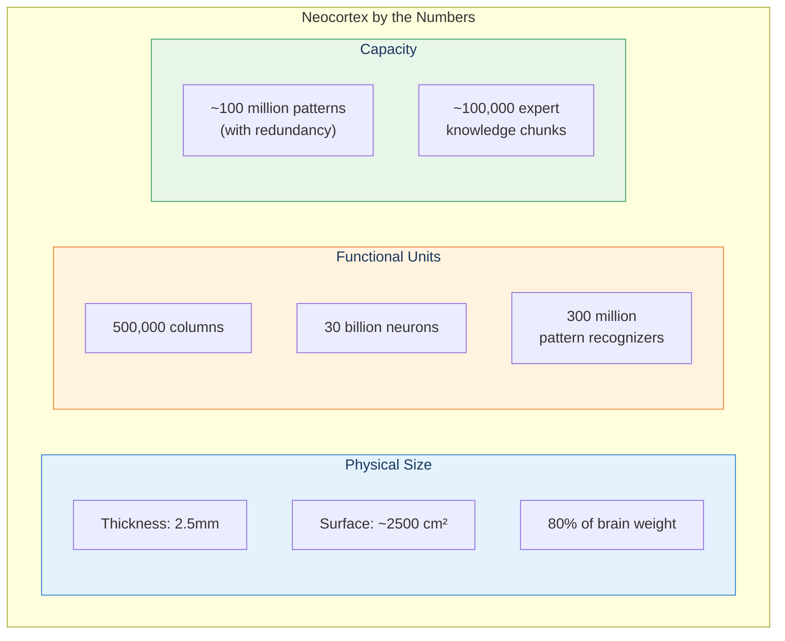
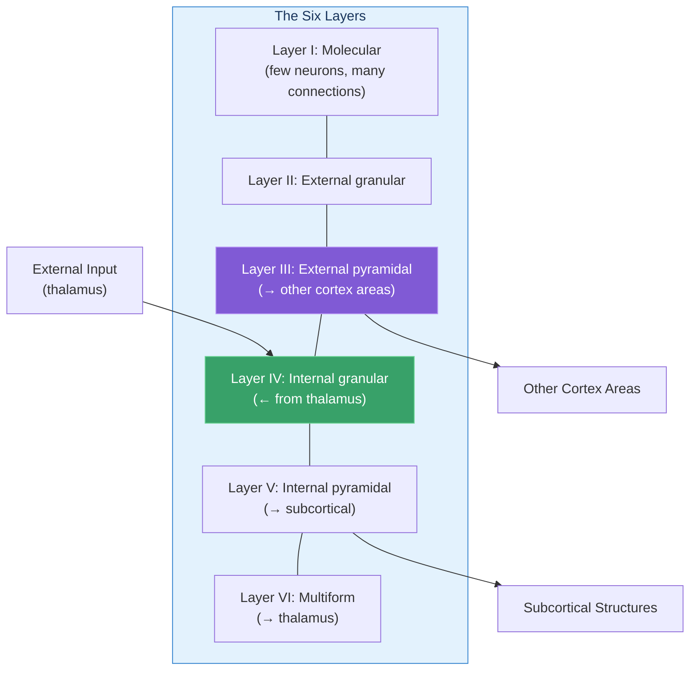
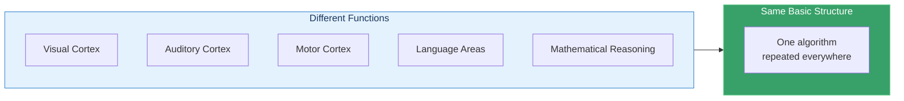
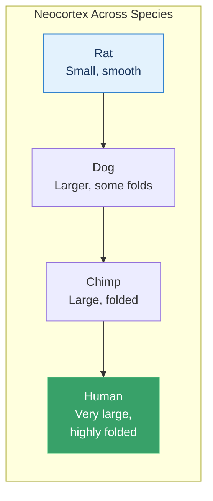

# The Neocortex

The neocortex ("new bark") is the thin, folded outer layer of the brain responsible for perception, memory, language, reasoning, and consciousness—essentially everything we consider "higher thought."

## Concept Overview

## The Numbers

## Six-Layer Structure

## The Key Insight: Uniformity

Vernon Mountcastle discovered that the neocortex has remarkably uniform structure everywhere:

This suggests that learning, perception, language, and reasoning all use the **same underlying mechanism**: hierarchical pattern recognition.

## Evolution and Size

Human neocortex is especially expanded in the **frontal lobe**, enabling abstract thought, planning, and language.

## Where This Appears in the Book

| Chapter | Context | Key Insight |
|---------|---------|-------------|
| [Ch 3](/chapters/03-pattern-recognition-theory/overview/) | Core theory | ~300 million pattern recognizers |
| [Ch 4](/chapters/04-biological-neocortex/overview/) | **Main coverage** | Physical structure detailed |
| [Ch 5](/chapters/05-old-brain/overview/) | Old brain | How it interacts with older structures |
| [Ch 6](/chapters/06-transcendent-abilities/overview/) | Unique abilities | What human-sized neocortex enables |

## Related Concepts

- [Pattern Recognition Theory](/concepts/prtm/) — What the neocortex does
- [Hierarchical Learning](/concepts/hierarchical-learning/) — How learning works
- [Consciousness](/concepts/consciousness/) — What emerges from neocortex activity

## Learn More

- **Chapter**: [The Biological Neocortex](/chapters/04-biological-neocortex/overview/)
- **Path**: [AI & Neuroscience](/paths/ai-neuroscience/)
