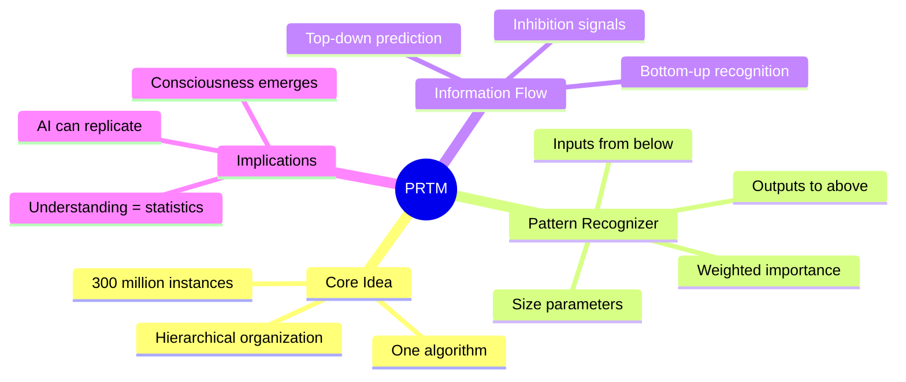
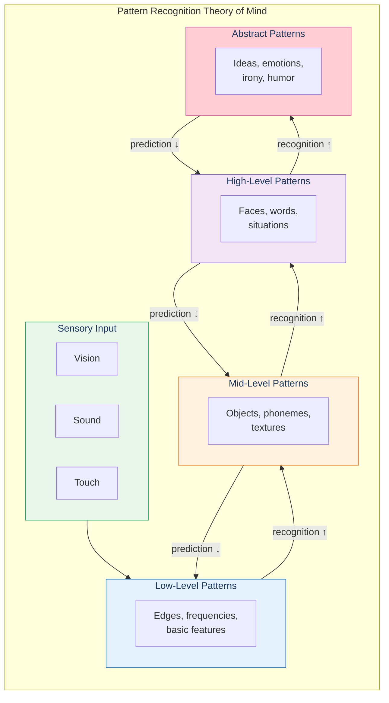
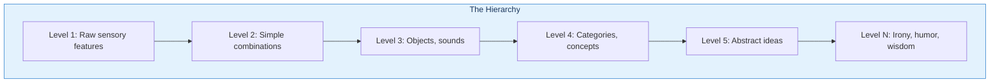
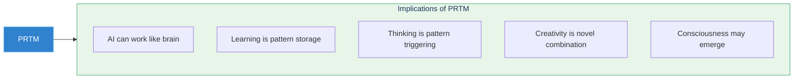

# Pattern Recognition Theory of Mind (PRTM)

The Pattern Recognition Theory of Mind is Kurzweil's central thesis: the neocortex uses a single, elegant algorithm—hierarchical pattern recognition—repeated approximately 300 million times to create all human thought.

## Concept Overview

## The Theory in One Diagram

## Key Components

### 1. The Pattern Recognizer Module

Each of the ~300 million pattern recognizers has:

| Component | Function |
|-----------|----------|
| Input dendrites | Receive signals from lower-level patterns |
| Importance weights | How critical each input is |
| Size parameters | Expected magnitude of each input |
| Variability parameters | How much size can vary |
| Output axon | Fires when pattern is recognized |
| Feedback connections | Send predictions down |

### 2. Hierarchical Organization

### 3. Bidirectional Flow

- **Bottom-up**: Recognition signals ("I see this pattern!")
- **Top-down**: Prediction signals ("Expect this pattern next!")

This explains:
- Why we can read degraded text
- Why context affects perception
- Why expectations shape experience

## Where This Appears in the Book

| Chapter | Context | Key Insight |
|---------|---------|-------------|
| [Ch 1](/chapters/01-thought-experiments-world/overview/) | Darwin/Einstein | Simple mechanisms create complexity |
| [Ch 2](/chapters/02-thought-experiments-thinking/overview/) | Self-observation | We recognize patterns instantly |
| [Ch 3](/chapters/03-pattern-recognition-theory/overview/) | **Core presentation** | Full theory explained |
| [Ch 4](/chapters/04-biological-neocortex/overview/) | Biology | Uniform neocortex structure |
| [Ch 7](/chapters/07-digital-neocortex/overview/) | AI applications | HMMs mirror brain |
| [Ch 11](/chapters/11-objections/overview/) | Objections | Defense of theory |

## Why It Matters

## Related Concepts

- [The Neocortex](/concepts/neocortex/) — The physical substrate
- [Hierarchical Learning](/concepts/hierarchical-learning/) — How patterns build on patterns
- [Law of Accelerating Returns](/concepts/loar/) — Why AI progress is exponential
- [Consciousness](/concepts/consciousness/) — What emerges from pattern recognition

## Learn More

- **Quick intro**: [Chapter 3 Overview](/chapters/03-pattern-recognition-theory/overview/)
- **Deep dive**: [Deep Dive: PRTM Learning Path](/paths/deep-dive-prtm/)
- **Technical**: [Hidden Markov Models](/chapters/07-digital-neocortex/hmm/)
