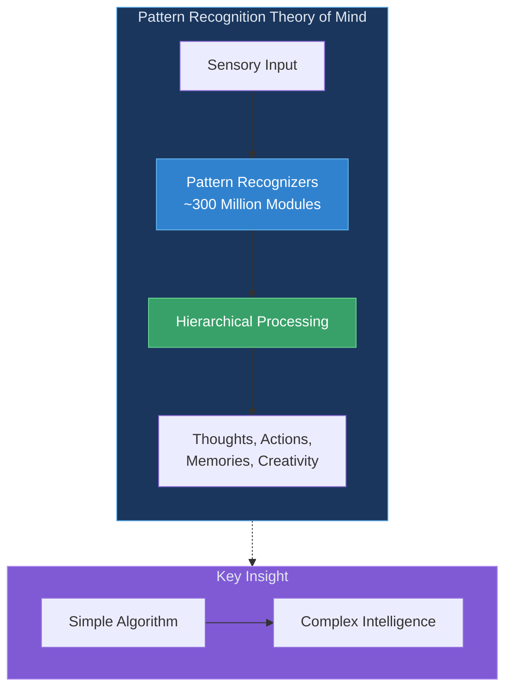

import { Card, CardGrid, LinkCard } from '@astrojs/starlight/components';

## The Big Idea

Ray Kurzweil's central thesis is that the **neocortex**—the thin outer layer of the brain responsible for higher thought—uses a single, elegant algorithm repeated approximately **300 million times**. This Pattern Recognition Theory of Mind (PRTM) explains how we perceive, remember, think, and create.

---

## How to Use This Companion

<CardGrid stagger>
  <Card title="By Chapter" icon="open-book">
    Follow Kurzweil's journey from thought experiments to building intelligent machines. Each chapter includes visual diagrams and key takeaways.
  </Card>
  <Card title="By Concept" icon="puzzle">
    Dive deep into specific concepts like the neocortex, hierarchical learning, and the Law of Accelerating Returns.
  </Card>
  <Card title="Learning Paths" icon="rocket">
    Choose a guided path based on your goals—whether you want a quick overview or a deep technical understanding.
  </Card>
  <Card title="Visual Diagrams" icon="seti:image">
    Every key idea is illustrated with Mermaid diagrams showing relationships, processes, and hierarchies.
  </Card>
</CardGrid>

---

## Book Structure at a Glance

```mermaid
flowchart LR
    subgraph Part1["Part I: Foundations"]
        C1["Ch 1: Thought Experiments<br/>on the World"]
        C2["Ch 2: Thought Experiments<br/>on Thinking"]
    end

    subgraph Part2["Part II: The Neocortex"]
        C3["Ch 3: Pattern Recognition<br/>Theory of Mind"]
        C4["Ch 4: Biological Neocortex"]
        C5["Ch 5: The Old Brain"]
        C6["Ch 6: Transcendent Abilities"]
    end

    subgraph Part3["Part III: Mind & Machine"]
        C7["Ch 7: Digital Neocortex"]
        C8["Ch 8: Mind as Computer"]
        C9["Ch 9: Thought Experiments<br/>on the Mind"]
    end

    subgraph Part4["Part IV: Implications"]
        C10["Ch 10: Law of<br/>Accelerating Returns"]
        C11["Ch 11: Objections"]
    end

    Part1 --> Part2 --> Part3 --> Part4

    style Part1 fill:#e3f2fd,stroke:#3182ce,color:#1a365d
    style Part2 fill:#fff3e0,stroke:#ed8936,color:#1a365d
    style Part3 fill:#e8f5e9,stroke:#38a169,color:#1a365d
    style Part4 fill:#f3e5f5,stroke:#805ad5,color:#1a365d
```

---

## Key Concepts Preview

<CardGrid>
  <LinkCard
    title="Pattern Recognition Theory"
    description="The neocortex as 300 million hierarchical pattern recognizers"
    href="/concepts/prtm/"
  />
  <LinkCard
    title="The Neocortex"
    description="The thin 2.5mm layer responsible for all higher thought"
    href="/concepts/neocortex/"
  />
  <LinkCard
    title="Hierarchical Learning"
    description="How patterns build upon patterns to create meaning"
    href="/concepts/hierarchical-learning/"
  />
  <LinkCard
    title="Law of Accelerating Returns"
    description="Why technology grows exponentially, not linearly"
    href="/concepts/loar/"
  />
</CardGrid>

---

## About This Book

> "The brain—is wider than the Sky— 
> For—put them side by side— 
> The one the other will contain 
> With ease—and You—beside"
>
> — Emily Dickinson

Published in 2012, **How to Create a Mind: The Secret of Human Thought Revealed** by Ray Kurzweil presents a comprehensive theory of how the human brain works and how we can use that understanding to create intelligent machines.

Kurzweil, a renowned inventor and futurist, draws on decades of work in artificial intelligence—including pioneering speech recognition and language understanding systems—to propose that the brain's neocortex uses a fundamentally simple algorithm, repeated hundreds of millions of times, to achieve the remarkable complexity of human thought.

---

## Start Your Journey

<CardGrid>
  <LinkCard
    title="Quick Overview Path"
    description="Get the key ideas in 30 minutes"
    href="/paths/quick-overview/"
  />
  <LinkCard
    title="Chapter 1: Thought Experiments"
    description="Begin with Darwin and Einstein's revolutionary thinking methods"
    href="/chapters/01-thought-experiments-world/overview/"
  />
  <LinkCard
    title="Chapter 3: The Core Theory"
    description="Jump straight to the Pattern Recognition Theory of Mind"
    href="/chapters/03-pattern-recognition-theory/overview/"
  />
</CardGrid>
