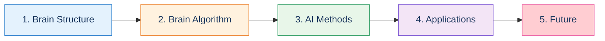
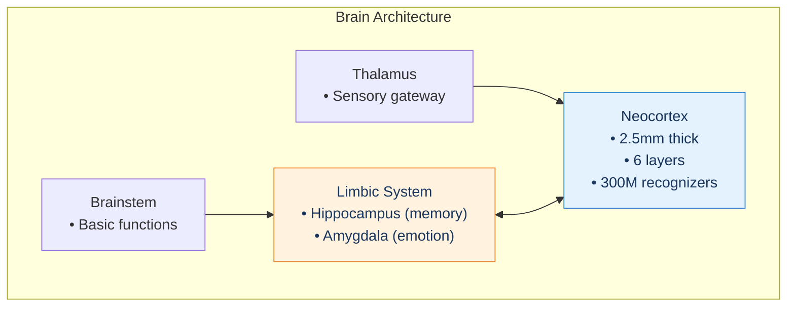
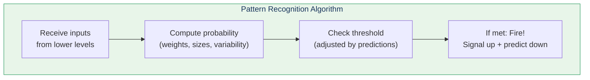
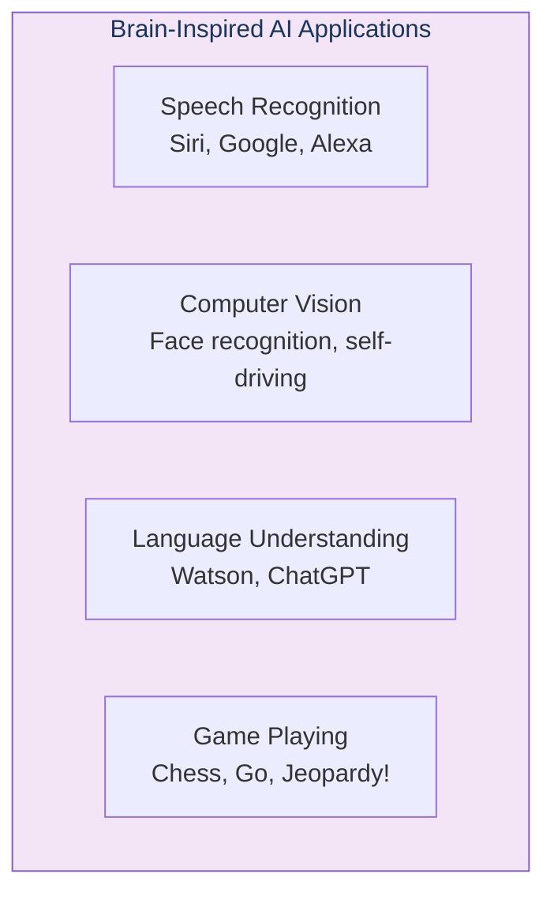
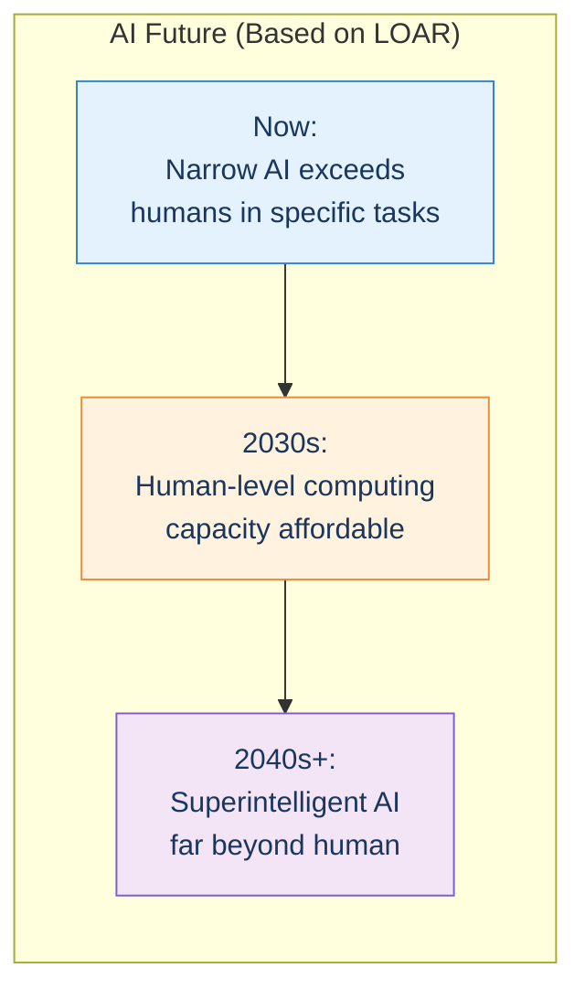

# Learning Path: AI & Neuroscience

This path explores the deep connections between neuroscience and artificial intelligence, showing how understanding the brain informs AI development.

## Path Overview

---

## Step 1: Brain Structure

**Goal:** Understand the physical architecture of the neocortex

### Read
- [The Neocortex](/concepts/neocortex/)
- [Chapter 4: Biological Neocortex](/chapters/04-biological-neocortex/overview/)
- [Chapter 5: The Old Brain](/chapters/05-old-brain/overview/)

### Key Structure

### Check Your Understanding
- [ ] Neocortex is remarkably uniform in structure
- [ ] Six layers with specific input/output roles
- [ ] Thalamus routes sensory information
- [ ] Hippocampus essential for memory formation

---

## Step 2: The Brain's Algorithm

**Goal:** Understand how the brain processes information

### Read
- [Chapter 3 Overview](/chapters/03-pattern-recognition-theory/overview/)
- [Pattern Recognizers](/chapters/03-pattern-recognition-theory/recognizers/)
- [PRTM Concept](/concepts/prtm/)

### Key Algorithm

### Check Your Understanding
- [ ] Each recognizer computes probability pattern is present
- [ ] Three parameters: importance, size, variability
- [ ] Top-down predictions lower threshold
- [ ] Same algorithm everywhere in neocortex

---

## Step 3: AI Methods

**Goal:** See how brain principles inform AI

### Read
- [Chapter 7: Digital Neocortex](/chapters/07-digital-neocortex/overview/)
- [Hidden Markov Models](/chapters/07-digital-neocortex/hmm/)

### Brain → AI Mapping

| Brain | AI Equivalent |
|-------|---------------|
| Pattern recognizer | HMM state |
| Importance weights | Emission probabilities |
| Expected size | Duration model |
| Size variability | Variance parameters |
| Hierarchy | Hierarchical HMMs |
| Top-down prediction | State transitions |

### Check Your Understanding
- [ ] HMMs mathematically similar to brain pattern recognizers
- [ ] Duration information was crucial for speech recognition
- [ ] Hierarchy dramatically improves performance
- [ ] Learning can discover parameters from data

---

## Step 4: Real-World Applications

**Goal:** See brain-inspired AI in action

### Read
- [Chapter 7: Digital Neocortex](/chapters/07-digital-neocortex/overview/)
- [Chapter 8: Mind as Computer](/chapters/08-mind-as-computer/overview/)

### Current Applications

### Check Your Understanding
- [ ] Modern speech recognition uses hierarchical methods
- [ ] Computer vision uses similar pattern recognition
- [ ] Watson understood natural language for Jeopardy!
- [ ] "Just statistics" is how brains work too

---

## Step 5: The Future

**Goal:** Understand where brain-AI convergence leads

### Read
- [Law of Accelerating Returns](/concepts/loar/)
- [Chapter 10: Law of Accelerating Returns](/chapters/10-law-accelerating-returns/overview/)
- [Consciousness](/concepts/consciousness/)

### Timeline

### Check Your Understanding
- [ ] Technology grows exponentially, not linearly
- [ ] Brain reverse engineering is accelerating
- [ ] Human-level AI is decades, not centuries, away
- [ ] Consciousness in AI remains open question

---

## Path Complete!

You now understand:
- ✅ Physical structure of the brain
- ✅ The pattern recognition algorithm
- ✅ How AI systems mirror brain methods
- ✅ Current brain-inspired applications
- ✅ The trajectory of AI development

**Continue with:**
- [Consciousness Concept](/concepts/consciousness/) — Deep philosophical questions
- [Chapter 11: Objections](/chapters/11-objections/overview/) — Counterarguments addressed
