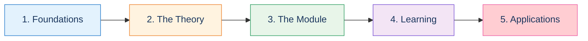
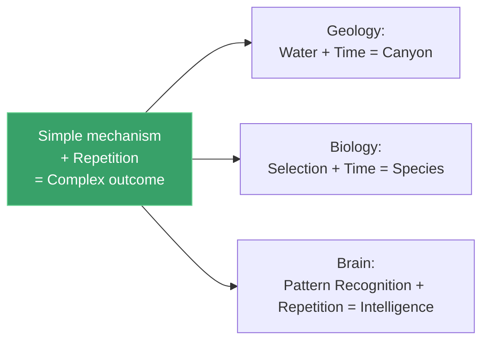
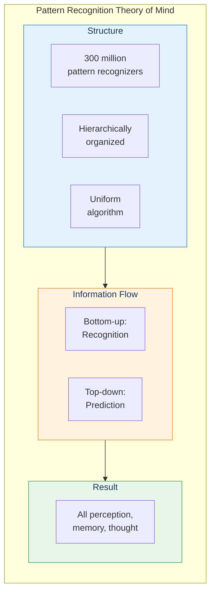
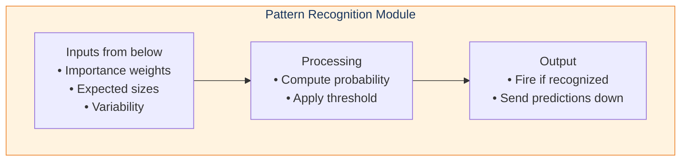
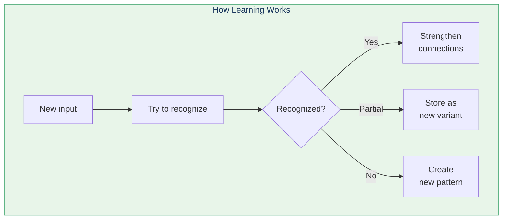
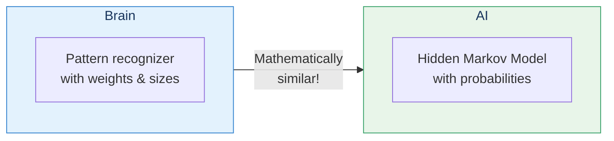

# Learning Path: Deep Dive into PRTM

This path takes you through a thorough understanding of Kurzweil's Pattern Recognition Theory of Mind—the core thesis of the book.

## Path Overview

---

## Step 1: Foundations

**Goal:** Understand how thought experiments reveal truths

### Read
- [Chapter 1: Thought Experiments on the World](/chapters/01-thought-experiments-world/overview/)
- [Darwin & Lyell](/chapters/01-thought-experiments-world/darwin-lyell/)
- [Einstein's Mind Experiments](/chapters/01-thought-experiments-world/einstein/)

### Key Insight

### Check Your Understanding
- [ ] Simple repeated processes can create complex outcomes
- [ ] Thought experiments can reveal deep truths
- [ ] This pattern applies to the brain

---

## Step 2: The Theory

**Goal:** Master the Pattern Recognition Theory of Mind

### Read
- [Chapter 3 Overview](/chapters/03-pattern-recognition-theory/overview/)
- [Hierarchy of Patterns](/chapters/03-pattern-recognition-theory/hierarchy/)
- [PRTM Concept Page](/concepts/prtm/)

### Key Diagram

### Check Your Understanding
- [ ] ~300 million pattern recognizers in the neocortex
- [ ] Patterns are composed of lower-level patterns
- [ ] Information flows both up and down
- [ ] Prediction (top-down) helps perception

---

## Step 3: The Pattern Recognition Module

**Goal:** Understand how each pattern recognizer works

### Read
- [The Pattern Recognizer Module](/chapters/03-pattern-recognition-theory/recognizers/)

### Key Components

### Check Your Understanding
- [ ] Each input has importance, size, and variability parameters
- [ ] Recognition is probabilistic, not exact
- [ ] Threshold can be lowered by top-down expectations
- [ ] Inhibition raises the threshold

---

## Step 4: Learning

**Goal:** Understand how patterns are acquired

### Read
- [Learning](/chapters/03-pattern-recognition-theory/learning/)
- [Hierarchical Learning](/concepts/hierarchical-learning/)

### Key Insight

### Check Your Understanding
- [ ] Learning and recognition use the same mechanism
- [ ] We can only learn one conceptual level at a time
- [ ] Redundancy is optimized across patterns
- [ ] Memories fade without reinforcement

---

## Step 5: Applications to AI

**Goal:** See how PRTM informs AI systems

### Read
- [Chapter 7: Digital Neocortex](/chapters/07-digital-neocortex/overview/)
- [Hidden Markov Models](/chapters/07-digital-neocortex/hmm/)

### Connection to AI

### Check Your Understanding
- [ ] HMMs are mathematically similar to brain pattern recognizers
- [ ] Hierarchy improves AI performance
- [ ] Duration/size information is crucial
- [ ] Real AI systems use these principles (speech, vision)

---

## Path Complete!

You now deeply understand:
- ✅ How thought experiments reveal principles
- ✅ The full Pattern Recognition Theory of Mind
- ✅ How each pattern recognition module works
- ✅ How learning acquires new patterns
- ✅ How these principles apply to AI

**Continue with:**
- [AI & Neuroscience Path](/paths/ai-neuroscience/) — Technical AI details
- [Consciousness Concept](/concepts/consciousness/) — Philosophical implications
