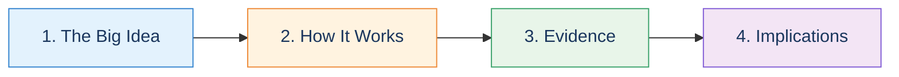
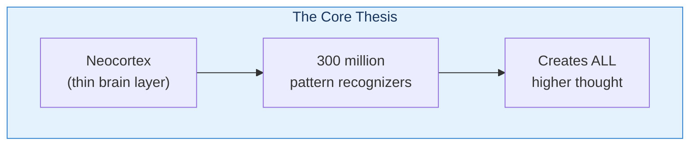
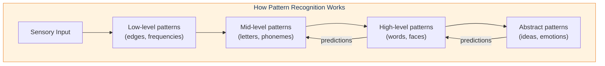
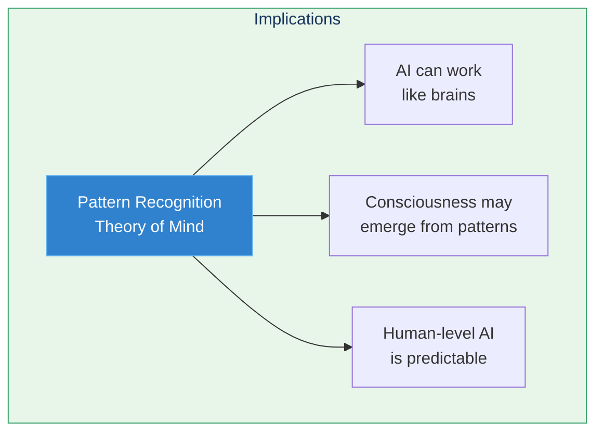

# Learning Path: Quick Overview

Get the essential ideas from Kurzweil's book in about 30 minutes. This path covers the core thesis, key evidence, and main implications.

## Path Overview

---

## Step 1: The Big Idea (5 min)

**Goal:** Understand Kurzweil's central thesis

### Read
- [Pattern Recognition Theory of Mind](/concepts/prtm/)

### Key Diagram

### Check Your Understanding
- [ ] The neocortex uses ~300 million pattern recognizers
- [ ] These recognizers are organized hierarchically
- [ ] The same algorithm is used everywhere in the neocortex

---

## Step 2: How It Works (10 min)

**Goal:** Understand how pattern recognition creates intelligence

### Read
- [Chapter 3 Overview](/chapters/03-pattern-recognition-theory/overview/)
- [Hierarchy of Patterns](/chapters/03-pattern-recognition-theory/hierarchy/)

### Key Diagram

### Check Your Understanding
- [ ] Patterns are made of simpler patterns
- [ ] Information flows both up (recognition) AND down (prediction)
- [ ] Top-down predictions help us perceive ambiguous input

---

## Step 3: The Evidence (10 min)

**Goal:** See the supporting evidence for PRTM

### Read
- [The Neocortex](/concepts/neocortex/)
- [Chapter 4 Overview](/chapters/04-biological-neocortex/overview/)

### Key Evidence

| Evidence | What It Shows |
|----------|---------------|
| Uniform neocortex structure | Same algorithm everywhere |
| Cortical plasticity | Regions can take over other functions |
| AI success with similar methods | HMMs work like pattern recognizers |
| ~100ms recognition time | Time for hierarchical processing |

### Check Your Understanding
- [ ] The neocortex has remarkably uniform structure
- [ ] AI systems using similar methods (HMMs) are successful
- [ ] The timing of human perception matches hierarchical processing

---

## Step 4: Implications (5 min)

**Goal:** Understand what PRTM means for AI and consciousness

### Read
- [Chapter 7 Overview](/chapters/07-digital-neocortex/overview/)
- [Law of Accelerating Returns](/concepts/loar/)

### Key Diagram

### Check Your Understanding
- [ ] AI systems can use brain-inspired pattern recognition
- [ ] Technology is growing exponentially (LOAR)
- [ ] Human-level AI may be decades, not centuries, away

---

## Path Complete!

You now understand:
- ✅ The Pattern Recognition Theory of Mind
- ✅ How hierarchical pattern recognition works
- ✅ The evidence supporting the theory
- ✅ The implications for AI and the future

**Continue with:**
- [Deep Dive: PRTM](/paths/deep-dive-prtm/) — For detailed understanding
- [AI & Neuroscience Path](/paths/ai-neuroscience/) — For technical depth
